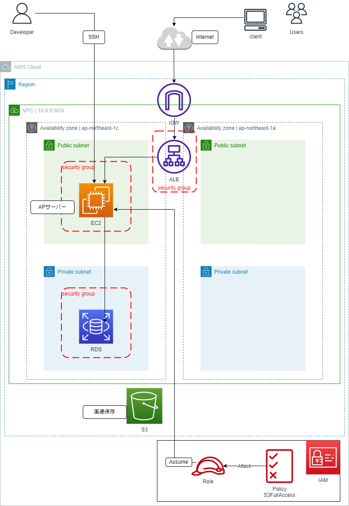

# 学習アウトプット用リポジトリ

## 概要

CRUD 処理が出来る簡単な Rails アプリケーションを稼働できるインフラストラクチャを構成しました

## 動作環境
### ruby

```bash
3.1.2
```
### Bundler
```bash
2.3.14
```
### Rails
```bash
7.0.4
```
### Node
```bash
v17.9.1
```
### yarn
```bash
1.22.19
```
### DB エンジン
- MySQL
```bash
v8.0.33
```

## CloudFormationで構築した環境の構成図



## AWS 環境構成説明
### 概要

このリポジトリに掲載されているAWS構成図は、Railsアプリケーションのインフラストラクチャを示しており、AWS CloudFormationを使用して設計・構築しています。

### 各ソリューション
#### EC2

- 今回は簡単なRailsアプリケーションを実行するため＋コストと複雑性を抑えるため、1台のEC2インスタンスを使用しています。

#### RDS
- アプリケーションのデータベースとしてAWS RDS MySQLを採用しています。
- 管理が容易で、スケーラビリティと高可用性が求められるデータベース要件に適しています。ただし今回はコストを抑えるため、Multi-AZとはしていません。

#### ALB
- EC2インスタンスの前に配置して、受信するHTTP/HTTPSトラフィックをEC2にルーティングします。
- アプリケーションの拡張性と可用性を考慮し、ALBを使用しています。

#### S3
- データの耐久性と可用性を確保するため＋スケーラビリティがあるため、画像ファイルの保存先としてS3を採用しています。

---

## 学習記録の説明
2023.6.14から入会した以降の学習記録です。講座ごとで出される各課題を.mdファイルにまとめて、mainブランチにmergeしています。
下表に講座・課題・レポートの対応を示します。<br>
|講座|概要|レポート|備考|
|:---|:---|:---|:---|
|第1回|AWSアカウント作成<br>IAMユーザー作成<br>MFA設定<br>Cloud9でHellow World(Ruby)|本リポジトリへの反映はなし|Discord上でキャプチャ提出|
|第2回|バージョン管理システム<br>GitHubでの開発の流れ<br>markdown|[lecture02.md](lecture02.md)|-|
|第3回|webアプリケーション(Rails)のEC2へのデプロイ|[lecture03.md](lecture03.md)|IDEはCloud9|
|第4回|手動でクラウドインフラ環境構築<br>VPC,EC2,RDS<br>EC2からRDSへの接続確認|[lecture04.md](lecture04.md)|IDEはこれ以降VScode|
|第5回|手動でクラウドインフラ環境構築<br>ALBとS3(IAMロール適用)を追加<br>EC2でNginxとUnicornで構成|[lecture05.md](lecture05.md)|S3は画像保存として適用|
|第6回|システムの安定稼働<br>CloudTrail、CloudWatch<br>Amazon SNS<br>メトリクス<br>Cost Explorer<br>Billing|[lecture06.md](lecture06.md)|-|
|第7回|システムにおけるセキュリティ|該当なし|-|
|第8回|第5回課題のライブコーディング（組み込みサーバでの稼働まで）|該当なし|-|
|第9回|第5回課題のライブコーディング（Webサーバ・Railsアプリサーバ分離～最後まで）|該当なし|-|
|第10回|CloudFormation<br>└第5回課題で作成した環境構築|[lecture10.md](lecture10.md)<br>└[～-vpc-01.md](lecture10-vpc-01.md)<br>└[～-sg-02.md](lecture10-sg-02.md)<br>└[～-ec2-03.md](lecture10-s3-06.md)<br>└[～-rds-04.md](lecture10-rds-04.md)<br>└[～-alb-05.md](lecture10-alb-05.md)<br>└[～-s3-06.md](lecture10-s3-06.md)|lecture10.mdをサマリーとして、詳細はスタック名を付けた名前の.mdファイルに分けました。<br>ymlファイルはlecture10_CFnTemlateフォルダに入れています|
|第11回|インフラのコード化を支援するツール<br>ServerSpec|[lecture11.md](lecture11.md)|2023.8.6からSAAの学習に入りました|
|第12回|CI/CDツール<br>CircleCI導入<br>config.ymlをリポジトリへ組込んで稼働|[lecture12.md](lecture12.md)|-|
|第13回||||
|第14回||||
|第15回||||
|第16回||||
<br>
以上
