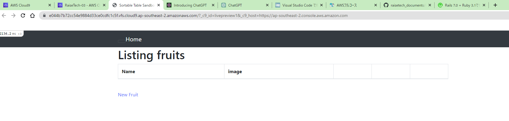
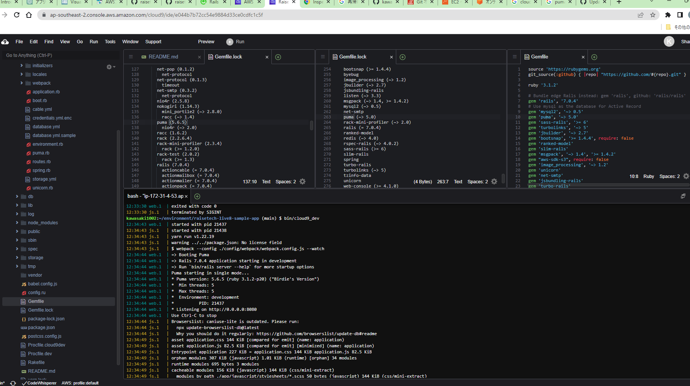
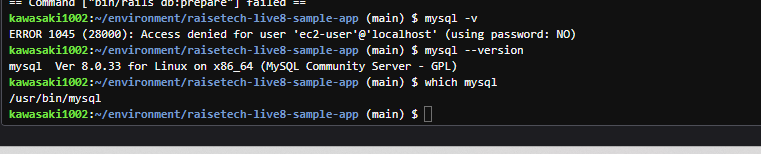
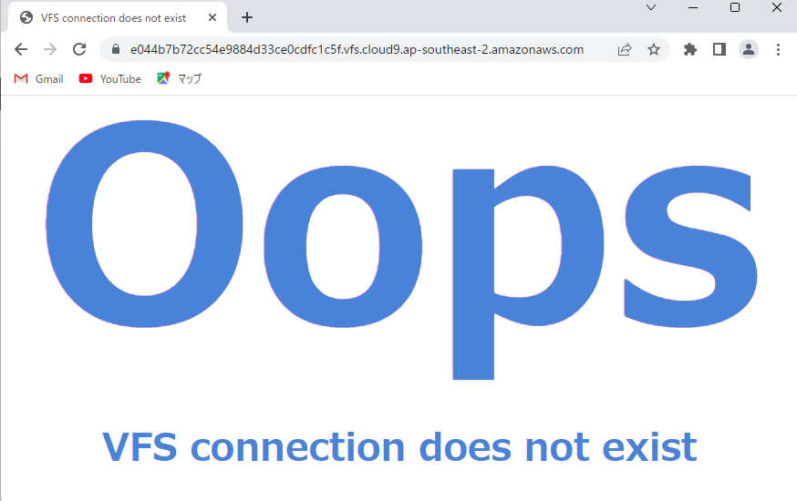
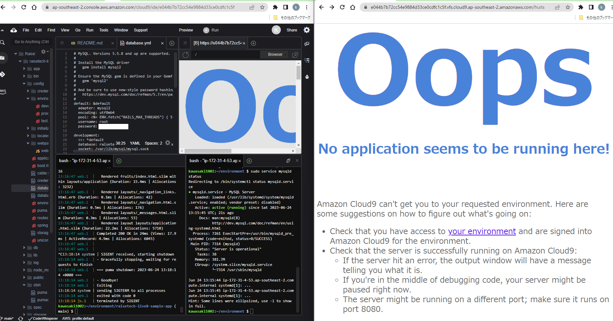
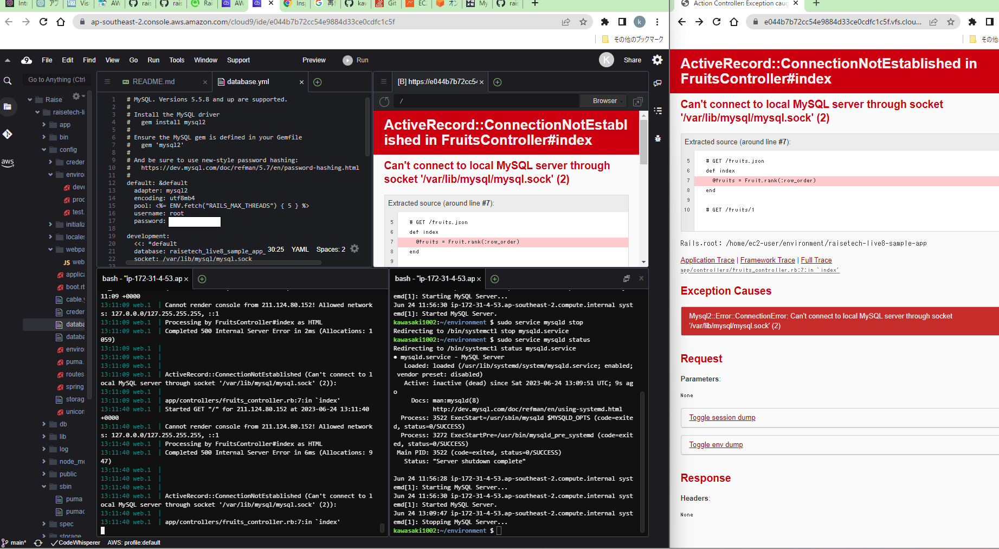

# 第3回課題_AWS講座
## 今回使用したサンプルアプリケーション
### アプリケーションサーバについて
* 名前：puma
* バージョン：5.6.5
* APサーバを終了した後、引き続きのアクセスは不可
* APサーバを起動させた後はアクセス可
* └ Cloud9を起動しているブラウザ以外のブラウザ(同じソフトでも)に同じURLを貼ってアクセスしようすると不可[^1]
  

### アプリケーションサーバと連携させたDBサーバについて
* 名前：mysql
* バージョン：8.0.33
* DBサーバ終了後、引き続きのアクセスは不可
 
***
#### 画面キャプチャ

***

### Railsの構成管理ツール
* Bundler（サンプルアプリのREADEMEで3.2.14、Gemfile.lock内「BUNDLED WITH 3.2.14」と記載あり）
* Gemfileに記されたバージョン情報に応じ許容範囲内で最新のGemをインストールしてくれる。また、最新バージョン情報など含め更新内容・詳細はGemfile.lockに反映されるらしい。
* 今回の演習では手動でBundlerをインストールではなく、以下の用意が完了した後に環境構築を指示するコマンド`bin/setup`により、実行したver2.3.7がほかのGemをインストールミスしたので、lockファイル指定の2.3.14をRubyGemsのサイトから勝手に取得・インストールしてくれ、再度2.3.14Bundlerによる他のGemのインストールが開始した。
  - Rubyの指定verインストール
  - npmからyarnをインストール∵Node.jsのバージョン管理ライブラリ。yarn.lockファイルを参照して必要なモジュールをインストールしたいため。
  - DBエンジンインストールして、セットアップ。mysql接続のためのパスワード控える。
  - 上記のpassをdatabase.ymlに反映＋ソケットファイルのディレクトリ反映。

## 今回学んだこと
### 1. サーバ構成
#### webサーバとAPサーバ
* 今回のサンプルアプリケーションは割と静的？な仕組みなので、webサーバも兼ねるAPサーバpumaで対応できていた。動的なwebアプリケーションとなるとunicornなどのAPサーバが必要となるが、unicornはwebサーバではないので、Node.jsなどのwebサーバが必要。アプリケーション自体の実行環境がRubyの場合Rackミドルウェアが必要で、対応しているAPサーバがunicornやpuma。
* EC2インスタンス上での仮想環境で構築するので、目でフォルダの存在がわかるローカルよりも、サーバのありか（ディレクトリ）やサーバ間の関係性のイメージが難しい。DBサーバはAPサーバからのリクエストを受け取るが、ディレクトリはAPの子階層ではなく、この仮想環境の最上位>var>...となっている。そのため、DBサーバへの起動や停止などの指示はアプリケーションのディレクトリから出てさらにsudoコマンドから指示することになる。sudo：SuperDo
#### 設定ファイル
* アプリケーションとして、各種設定ファイルが.sampleファイルとして梱包されていることがある。連携させるDBサーバ（DBエンジン）により、ファイルの中身で指定しているディレクトリ（ソケット接続するならソケットファイル.sockのディレクトリ）や接続するためのusernameやpasswordを埋め込む必要があため。今回はdatabase.yml.sampleファイルとして梱包されており、いったん同じディレクトリ内にコピペして、ファイル名称の末尾を.ymlにして中身を上記の通り編集した。上書き保存はCtrl+Sでできた。
* .ymlはXMLやJSONよりもシンプルな記載。いずれも入れ子構造として記載するが、XMLは＜タグ＞＜/タグ＞で表すが、他2つは、項目：設定値のような箇条書き。JSONは入れ子構造の川上と川下に｛｝を入れる。
* .yamlは.ymlと同じであるが、いろいろと.ymlのほうがいい。
### 2. 環境構築が難解
* 今回はCloud9なので、RubyやNode.jsなどの各種実行環境を構築（インストール）する必要がないが、現場ではCloud9を使うことのほうが少ないとのこと。課題を進めることを優先したので、ローカルでの環境構築諦めた。引き続き勉強必要。また、WindowsよりもmacOSやLinuxのほうがやりよいかなと思った。
* 今回はLinux環境なので、Rubyのバージョン切り替え(rvm)、sudoコマンド、などが使えたが、現場でLinux以外のこともあるだろうから引き続き勉強必要。
* 他、理解が足りてないなと思ったこと
    * Railsとyarnとwebpack、webpackerの関係性
    * [^1] :Cloud9から起動したブラウザと別途起動したブラウザでアクセスできるできないが異なるわけ。
