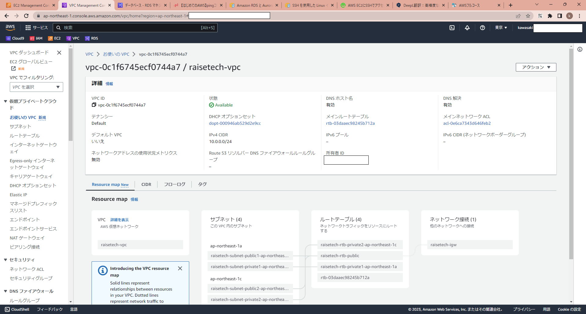
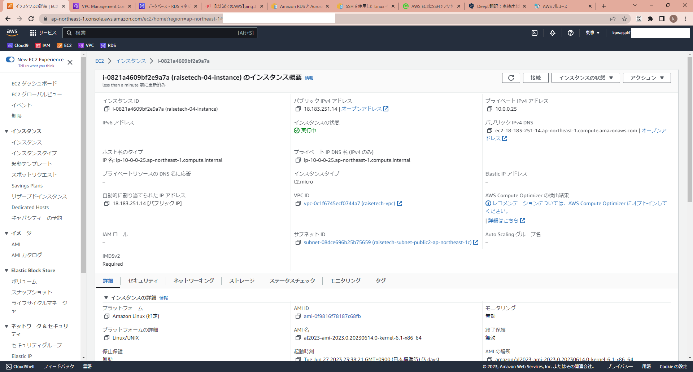
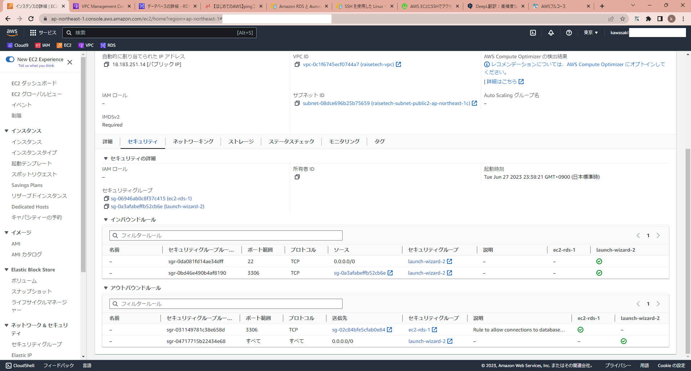
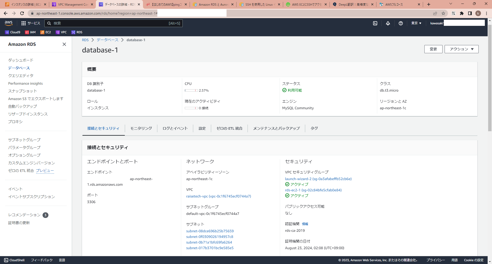
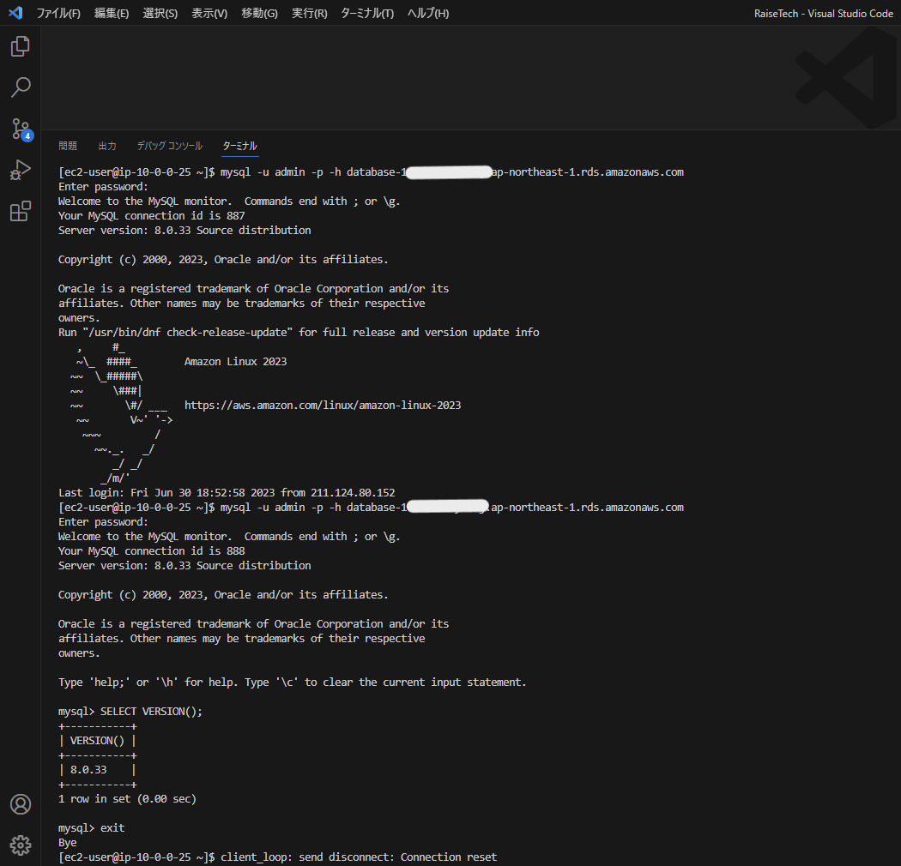

### VPC（新しく作ったもの）

### 構築したEC2インスタンス

### 構築したRDS

### EC2 から RDS へ接続確認

### 理解したこと
* AWS上で各種サーバを立てること自体は難しくはないが、それぞれのつながり方がイメージすることが大事
* EC2インスタンスの構築過程でOSをAmazon Linux 2ではなくAmazon Linux 2023を選択していたことに後で気づいた。気づいたのは、MySQLのインストールが一向に完了しなかったことから。
  * 当該OSに対応していないパッケージをDLしており、インストールがOSに許容されなかったからだと思う。
  * 結局ＲｅｄＨａｔ系として用意されていたパッケージ（MySQLのリポジトリ）をDLして、インストールできた。
* RDS内のMySQLへの接続のコマンドは`mysql -u admin -p -h "RDSエンドポイント"`とわかった。adminをいれておかないとダメっぽい。
* "RDSエンドポイント"の例：`databaseXX.xxxxxxxxxxxxxx.ap-northeast-1.rds.amazonaws.com`

