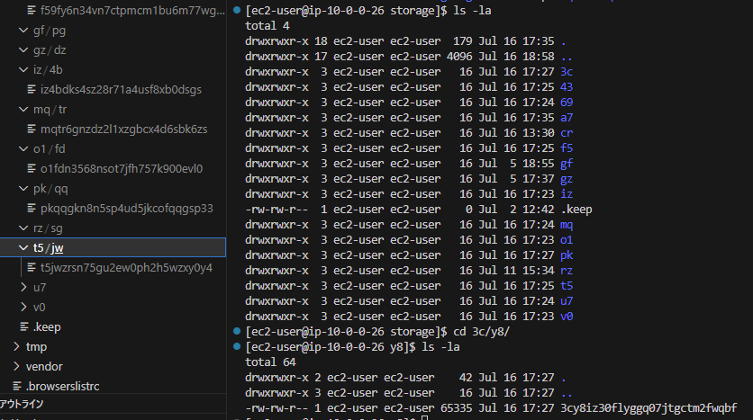
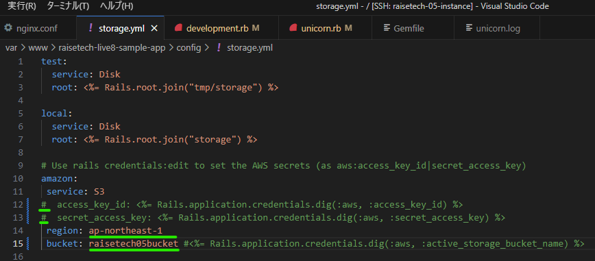

# 第5回課題
第4回課題で構築したVPC、サブネット、AZ、EC2、RDSの構成を引き継いで構成しました。
## 実行環境の用意
第3回課題の[sampleアプリケーション](https://github.com/yuta-ushijima/raisetech-live8-sample-app)を稼働させるための環境を用意しました。  
* rubyはrvmによりインストールすることにしました。 rvm自体のインストールは下記の記事を参考にしました。  
  └参考記事）
  * [rvmを使って最新のrubyをinstallする](https://ishiis.net/2016/09/25/ruby-install/)
  * [（RVM）鍵のインストール](https://blog.proglus.jp/1735/)
  * [RVMの公式サイト](https://rvm.io/rvm/security)
* rubyのインストール確認後、`gem install bundler:2.3.14`
* mysqlクライアントのインストール（第4回課題でインストール済み※）
  * 第4回課題のときは、第3回課題時の流れで[こちら](https://github.com/MasatoshiMizumoto/raisetech_documents/blob/main/aws/docs/install_mysql_on_cloud9_amazon_linux_2.md)の方法通り実行してしまっていましたので、EC2インスタンス内に仮想サーバが立ち上がってしまっていました。.sh（シェルスクリプト）ファイル内の`sudo yum install -y mysql-community-server`により、MySQLのサーバーソフトウェアとパッケージ依存関係としてクライアントアプリケーションも自動的にインストールされていました。そのため、クライアントだけをvar>>bin内に残し、mysql server serviceはアンインストールしたのでした。
  * 今後、例えば、RDS内のDBエンジンと別のインスタンスから、MySQLとやりとりすときはクライアントのみをインストールするように気を付けます。  
└参考記事）[Amazon Linux2にMySQLのclientだけをインストールしてRDSに接続する方法](https://qiita.com/tamorieeeen/items/d9b2af588f1dfd43120d) 
* `bundle install`  
* yarnのインストールの参考記事）[Yarn（や～ん！）【nvm、node、npm、yarnについて】](https://www.maruzen-p.jp/news/31)  

上記を実施して、実行環境を用意しました（下図参照）。  

  
nodeのデフォルトがv18系を使用することになっていたので、アプリケーション指定のv17.9.1がデフォルトで有効になるように`nvm alias default v~`で指定できました。

## 組み込みサーバ(puma)だけでrailsアプリ起動

### unicronでrailsアプリ起動
`unicorn_rails -c config/unicorn.rb`  （←-Eの引数入れなければデフォルトでdevelopment環境で起動）
あとでnginxと連絡するための設定をunicron.rbが保持しているので、Listenの箇所をポート3001にしてみて実施しました。3001はテキトーですが、これに伴いセキュリティグループのインバウンドルールはポート3001解放しました。  

## nginx起動確認
nginxのインストール参考記事）[Amazon Linux2にnginxをインストールする方法](https://qiita.com/tamorieeeen/items/07743216a3662cfca890)  
`sudo systemctl reload nginx`  設定ファイルnginx.conf編集したら必ず実施  
`sudo systemctl restart nginx`  再起動  
`sudo systemctl status nginx -l`  -lは見切れなしで状態を表示  
`sudo nginx -t`  構文check(statusでも十分)
.png)  
nginx.confの設定の[参考記事）](https://zenn.dev/noraworld/articles/deploy-rails-application-with-nginx-and-unicorn)  
ALB適用に向けての設定内容は下図の通り。  

## ALB適用
設定自体はAZ複数にまたがった状態となりますが、対象のインスタンスは1つでも設定できるとわかりました。  

## DNSからrailsアプリへアクセス
unicorn.rbのListenの箇所を下図の通り修正し、railsを再起動→DNSをブラウザで叩きました。  

.png)
### unicornの実行タスクのカスタム
以下の参考記事に沿って、次のコマンドを使えるようになってかなり快適になりました。（感謝）  
`rails unicorn:stop`  停止してから開始した方が再起動のコマンドより早い  
`rails unicorn:start`  
`ps aux|grep unicorn`  unicornと名の付くプロセスを確認（何行か出れば動いている。1行のみでゼロ秒なら止まっている）  
参考記事）[Unicorn の起動・停止スクリプト](https://zenn.dev/noraworld/articles/deploy-rails-application-with-nginx-and-unicorn)  
***

## S3の追加
### 使用用途の基準
* あまり変更がない
* アクセスが多くない
* 静的なファイル
* 例：ログファイル、画像ファイルの保存  
→今回は画像ファイルの保存用途として適用しようと思います。

### Railsアプリはどこで画像保存を制御しているのか
以下の1がデフォルトの場合、2のlocal:ブロックが保存先となるとわかりました。つまりなにも設定していなければ、localとなります。デフォルト状態で、画像保存先はstorageのディレクトリとわかったので、なかをみると、登録した画像に一意のIDが降られたファイルとして存在するようでした。ただ、実態として・絵として確認仕方がわかりませんでした（下図参照）。  
  
***
1. `/var/www/raisetech-live8-sample-app/config/environments/development.rb`  

35行目がデフォルト。36行目が追加したところ。

2. `/var/www/raisetech-live8-sample-app/config/storage.yml`  
  
緑マーク箇所を追記。アクセスキーID、シークレットアクセスキーをコメントアウトしている理由は後述参照（[IAMロールをEC2インスタンスにあてる](#iamロールをec2インスタンスにあてる)）。

参考記事）
* [railsガイド](https://railsguides.jp/){:target="_blank"}
* [└ActiveStorageの記事](https://railsguides.jp/active_storage_overview.html){:target="_blank"}
* [ActiveStorageでS3を使う場合、storage.ymlの認証情報は必須項目ではない](https://shinkufencer.hateblo.jp/entry/2018/07/27/080235){:target="_blank"}

### IAMロールをEC2インスタンスにあてる
はじめIAM"ユーザー"を作成し、このユーザに対してS3fullaccess権限を与え、このユーザーに紐づくアクセスキーを作成しようとしていました。  
すると以下の代替案が推奨されました。ロールでの設定です。ロールを作成し、S3fullaccessレベルのポリシーをロールに付けて、このロールをEC2インスタンスにアタッチする形です。  
ユーザーにポリシーを付ける場合との違いはアクセスキーとシークレットキーを要しない点です。なお、web記事ではアクセスキーとシークレットキーをstorage.ymlファイル内に定義づける旨の説明が多い印象でした。  
.png)  
参考記事）[Amazon EC2 インスタンスで実行されるアプリケーションに IAM ロールを使用してアクセス許可を付与する](https://docs.aws.amazon.com/ja_jp/IAM/latest/UserGuide/id_roles_use_switch-role-ec2.html?icmpid=docs_iam_console){:target="_blank"}  
  
S3用にIAMロールを作成し（以下の通り）、アプリケーションが入っているEC2インスタンスに当該ロールを適用しました。  

  
適用確認とS3への接続確認は下図の通り。  
`aws configure list`  
`aws s3 ls`  

### DNS経由でRailsアプリケーションにレコード＋画像追加→S3保存
1. 画像表示されるように環境整え
第3回の課題段階で画像登録はしていたのですが、オブジェクトがあることを示すアイコンのみで、画像自体は表示されていなかったのです（下図の通り）。  
.png)  
そして、上述の設定適用して、アプリ再起動していたのですが、なぜかずっとWe're sorry~の画面が出続けていていました。  
  
railsアプリケーションで画像を登録する場合、何が必要なのかなど、立ち返って調べ、ImageMagickが必要であるとわかりました。  
参考記事）
[Railsの画像まわりのライブラリについて整理する](https://qiita.com/fgem28/items/54c5ca70753f16ef420c)  
ImageMagickのインストールから対応しました。  
  
ImageMagickのインストール確認：`convert -version`（直感的ではないので特にメモ）
  
その後もWe're sorry～は出ていたのですが、挙動細かめに把握するために以下の順に実施していたら、なぜかS3と繋がって反映され、We're sorry～がでなくなり、意図する挙動となってくれました。（設定自体はあっていたが起動順が何かに影響していた？）  
2. pumaだけでrails起動(bin/dev)→localhost:3000で画像登録→ok（S3に登録され画像表示された）
3. pumaだけでrails起動→パブリックIP:3000で画像登録→ok
4. unicornで起動→パブリックIP:8080で画像登録→ok
5. unicorn起動＋nginx起動→DNS経由で画像登録→**ok Σ(ﾟДﾟﾉ)ﾉ！**  
   └下図参照
     

## 構成図

