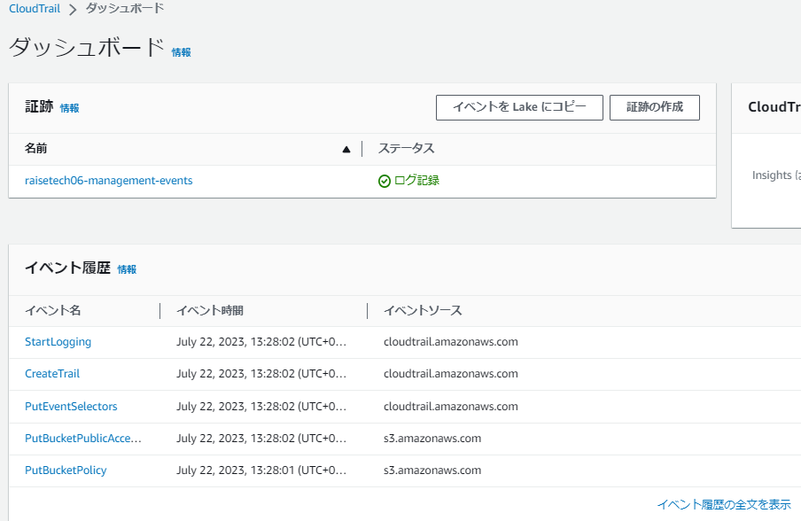

# 第6回課題
## インフラの安定稼働のため使うAWSサービス
今回学習したものを下表にまとめてみました（空欄箇所は今後埋めていきます）
サービス|サービス内容|備考
:---|:---|:---
AWS CloudTrail|ほぼすべてのAWSイベントを記録 アプリケーションの証跡は保持しない|   |
AWS Config||
VPCフローログ||
CloudWatch||監視系
└ CloudWatch Logs||
└ CloudWatch メトリクス|何を監視したいかによってデータポイントを、名前空間・メトリクス名・ディメンジョンでカテゴライズする|
└ CloudWatch アラーム|メトリクスから取得する値にしきい値を付け、アラーム状態/OK状態の時にアラームを出す|Amazon SNSと連携
└ CloudWatch logs メトリクスフィルター||
EventBridge||

## AWSでのコスト管理
今回学習したものを下表にまとめてみました（空欄箇所は今後埋めていきます）
サービス|サービス内容|備考
:---|:---|:---
AWS pricing calculator|使用したいリソースでの見積が可能|[課題6-3の参考記事参照](#課題6-3aws利用料の見積り)
Billing|請求情報が見れる|サービスごとの利用時間も見れる
Cost Explorer||
Budget||
Cost Anomaly Detection||

## 課題6-1｜AWS利用の直近記録抜き出し
### AWS CloudTrail
下に示す[操作](#操作方法)からCloudTrail で取得したイベントにどういった内容が含まれるか下表にピックアップします。イベント内容の読み方など以下の記事を参考にしています。不正なアクセスや操作がないかの検知は下表のうち例えば「aws-intenal」を含まないレコードがあるかを検出する方法があることを理解しました。  
参考記事）  
 [CloudTrail レコードの内容](https://docs.aws.amazon.com/ja_jp/awscloudtrail/latest/userguide/cloudtrail-event-reference-record-contents.html)  
 [CloudTrail を用いて不適切な操作を検出する](https://aws.amazon.com/jp/blogs/news/using-cloudtrail-to-identify-unexpected-behaviors-in-individual-workloads/)

イベント：ListBuckets  
|含まれる内容|今回の例|
|:---|:---|
|イベント名 (eventName)|ListBuckets|
|リクエストが行われたサービス (eventSource)|S3|
|リクエストが行われたエージェント (userAgent)|aws-internal/3 aws-sdk-java|
|誰がアクションを実行したか (userIdentify) (sourceIPAddress)|（割愛）|

#### 操作方法
CloudTrailはuserが意図せずともイベントを記録してくれているので、「証跡の作成」ボタンからはじまります。今回の操作では抽出するユーザーと日付を絞っています。  
  
証跡名入力。デフォルトでS3バケットが新規に作成されるようです。
  
証跡枠生成される
  
約3分してからのダッシュボードの画面
  
選択したイベント  

## 課題6-2｜ALBのアラーム設定→メール通知
### CloudWatch アラーム
#### 設定内容
CloudWatch枠生成  
  
メトリクス選択  
  
メトリクス選択2  
  
アラーム設定  
  
アラーム設定2  
  
アラーム設定直後(EC2インスタンス開始していないので)  
  
SNStopicの確認メール  
  
SNStopicの確認画面  
  

#### Railsアプリケーションが使えない状態
【UnhealthyHostCont】Healthy時のコンソール画面です（メールは来ず）  
  
【HealthyHostCount】Healthy時のコンソール画面です（メールは来ず）

#### Railsアプリケーションが使える状態
【UnhealthyHostCont】Unhealthy時のアラームメールです。  
  
【HealthyHostCount】UnHealthy時のアラームメールです。  

#### しきい値・アラーム・アクションの関係
1. しきい値とアラーム：条件がしきい値●●以上/以下/より大きい/より小さいで表され、その条件に合致する場合がアラーム発動条件になるようです。（しきい値：●●のこと）
  └ウィザード画面でも「＜メトリクス名＞が次の時...アラーム条件を定義します。」と表示あり。
1. アラームアクションとアラーム：アラームアクションのトリガー＝アラーム状態とするとき、１の条件に合致したらアラーム発動します（直感的なのでよくわかる）。つまり定義した条件に合致することがアラーム状態ということです。
2. OKアクションとアラーム：UserにOKだよと伝えたいケース＝しきい値の範囲内。しきい値の範囲内＝１で定義した逆の状態のときにOKアクションとしてのアラームが発動。今回OKアクションアラーム設定時の条件を"HealthyHostCountが1以上のとき"と定義（1）していました。アクションの様態によらず、定義した条件に当てはまることはアラーム状態として扱われ、この逆の条件である、1未満の時がOK状態となります。OKアクションアラームと設定したためOK状態になったので、OKを示すメールを受信しました。
##### まとめ｜以下を整理して求めに直感的にマッチするようにアラーム設定すること
* メトリクスとして受け取るものが、何を検知したいものなのか（正常系/異常系の検知）
* 異常であることを知らせたいのか、OKであることをしらせたいのか（、データ不足：データポイントがない状態を知らせたいのか）

## 課題6-3｜AWS利用料の見積り
### AWS pricing calculator, Budget
今回までに作成したリソースの内容を、無料枠考慮せずに見積もるということをします。
#### 仮定
* EC2インスタンスとRDSの組み合わせは2セット用意して1AZに1セット置くことにします。
* EC2、RDSのインスタンスタイプは以下の記事を参考にします。第5回課題までで構築したものは動的webサイトではないと思いますが、実際の現場では静的であることのほうが少ないと仮定して。。
参考記事）
[30 の目的別 クラウド構成と料金試算例](https://aws.amazon.com/jp/cdp/)  
└[動的 Web サイトのためのクラウド構成と料金試算例](https://aws.amazon.com/jp/cdp/midscale-webservice/)
#### 見積り
[My Estimate](https://calculator.aws/#/estimate?id=bce9010f2942f6582daa68c3f59b0e4eaa1b1878)  
↑こちらが作った見積のURLです。URL切れが心配なのでキャプチャを貼ります↓  

参考記事）[AWS無料利用枠](https://aws.amazon.com/jp/free/?all-free-tier.sort-by=item.additionalFields.SortRank&all-free-tier.sort-order=asc&awsf.Free%20Tier%20Types=*all&awsf.Free%20Tier%20Categories=*all)

## 課題6-4｜EC2の利用料を確認
先月（2023/6）の請求情報EC2 の料金を確認しました。
  

* 無料利用枠には収まりませんでした。  
└6月は第3回課題でCloud9でサンプルアプリケーションをデプロイしており、t2.microではうまく稼働せず、途中でt3.smallにインスタンス変更したのでした（region：Sidney）。
* 第3回課題がクリアした後は料金かかったインスタンスと紐づくEBSを削除し、他の課題ではt2.microで対応できたので、無料枠範囲(free tier)で使用できました。なお、7月はRDSのインスタンスを無料枠外で適用しているのでその分有料にはなります。

## その他関連として学んだこと
#### API
「2つのソフトウェアコンポーネントが一連の定義とプロトコルを使用して相互に通信できるようにするメカニズム」です。AWSのAPIではHTTPがプロトコル。
参考記事）[AWS の API を理解しよう !](https://aws.amazon.com/jp/builders-flash/202209/way-to-operate-api/?awsf.filter-name=*all)
#### JSON（JavaScript Object Notation）
###### 意味
Notationが表記法という意味なので、JavaScriptオブジェクトの表記法ということで、htmlやmarkdownのような表現形式の一つです。JavaScriptはプログラミング言語という立ち位置なので、別物。**ヒト**にも機械にも理解しやすいらしいです。。
#### CloudWatchがずっと「データ不足」状態のまま
今回CloudWatchアラーム設定後、5分越えても「データ不足」状態だったので調べてみたら、今回とは別の事象で「データ不足」状態が続くことがある記事があったのでメモしておきます。ちなみに今回の「データ不足」状態は、EC2インスタンス実行（かつnginx起動状態）し、かつRails停止の時にから「ALARM」状態となりました（Rails起動したらOK状態になりました。）。そして再びEC2を停止すると、「データ不足」状態になりました。この時ALBはactive状態ですが、targetgroupのヘルスチェックはHealthy:0、Unhealthy:0、Unused:1（Health status details:Target is in the stopped state）でした。アラーム元のメトリクス「UnHealthyHostCount」がCloudWatchにレポートする条件が「**レポート条件: ヘルスチェックが有効になっている場合にレポートされます**」で**ディメンション**として「**TargetGroup**」がありました。targetgroupが停止していることで、でメンションとして定義された「**TargetGroup**」レベルが無⇒**データポイント**が無⇒データポイントのまとまりであるメトリクスが生成されない⇒CloudWatchにもレポートされない⇒「データ不足」状態として表現される、ということだと理解しました。

参考記事）
* [CloudWatchアラームがいつまで経ってもデータ不足のままの時は](https://mgre.co.jp/blog/8695)  
* [ALB（Application Load Balancer）を導入する](https://qiita.com/kobayashi-m42/items/9f6dd14ad1e4dc7cab4c)  
* [ターゲットグループのヘルスチェック](https://docs.aws.amazon.com/ja_jp/elasticloadbalancing/latest/application/target-group-health-checks.html)
* [Application Load Balancer の CloudWatch メトリクス](https://docs.aws.amazon.com/ja_jp/elasticloadbalancing/latest/application/load-balancer-cloudwatch-metrics.html)
