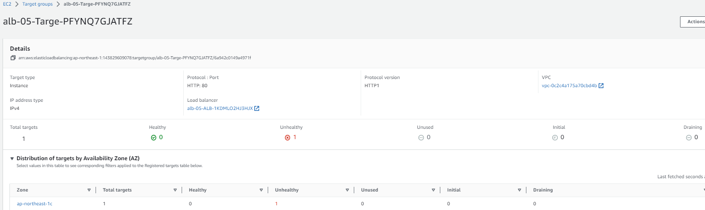
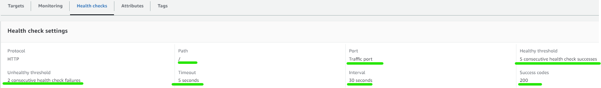
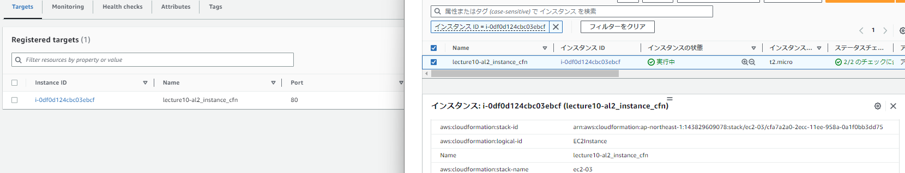
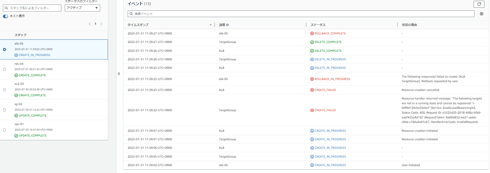

## Resources:
▼論理ID：ALB、ALBListener 
  
**設定しないことによるデフォ確認**（緑マーク）
 
▼論理ID：TargetGroup 
  

## 完了に至るまでに間違えたこと
### 1｜EC2停止状態で作成
* はじめ、EC2スタックが作成完了したあと、翌日ALB設定しようと思って停止しました。そしてALBスタック作成試みると以下のエラーがでました。EC2起動したらスタック作成されました。→**ロードバランサーはEC2起動中でないと適用できない。**
 

