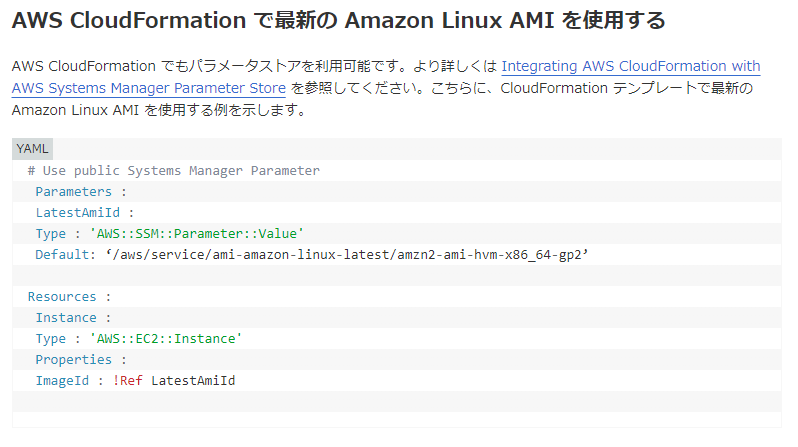
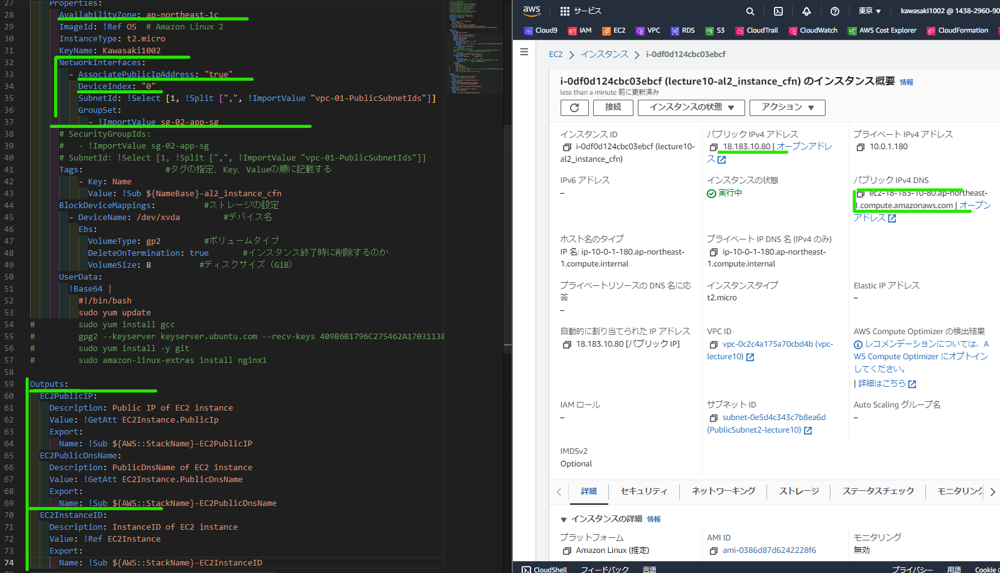
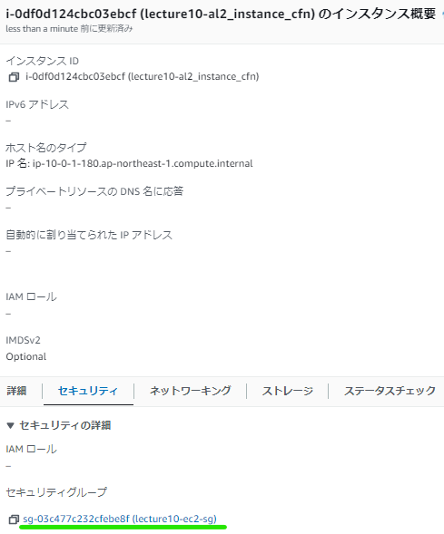
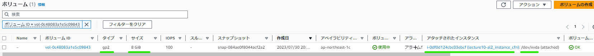
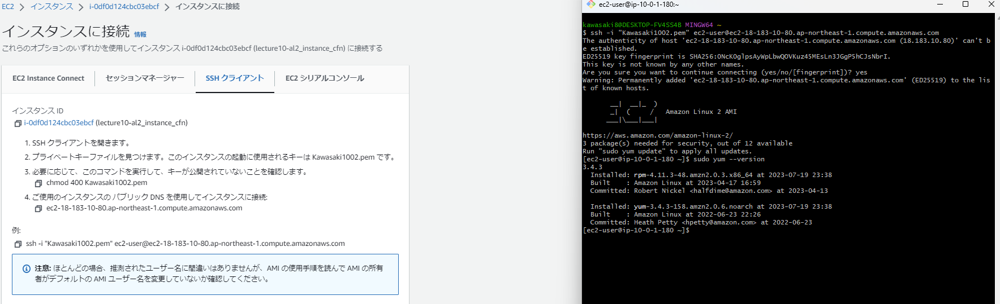
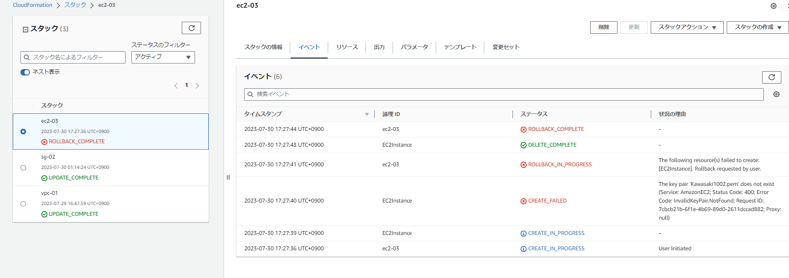
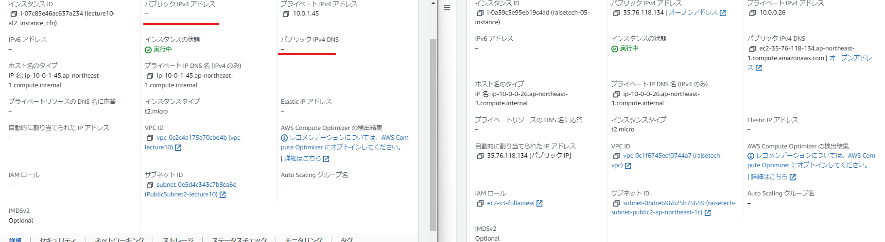

## Parameters:
▼論理ID：OS: 
以下の参考記事に習ってAmazon Linux 2の最新のAMIを取得するよう定義しました。  
  
[参考記事）AMI自動取得](#ami自動取得)
## Resources:
▼論理ID：EC2Instance: 
緑マーク：最初パブリックアドレスが表示されなかったので、Propaties内にNetworkInterfaceのAssociatePublicAdressをOnしたというマークです。  
 
**適用したSG**  
 
**定義したEBS**  
 
**一応接続確認**  

## 完了に至るまでに間違えたこと
### 1｜キーペアのプライベートキーファイル名を誤る
単純にキーファイル名のみ記載すればよかったのですが、拡張子含めて記載しておりエラー返されました。  
  
### 2｜パブリックIPなどが出ない
上記のKeyName問題解消したらスタック自体は作成成功しましたが、パブリックIPなどが生成されていませんでした。上述と重複しますが、Propaties内にNetworkInterfaceのAssociatePublicAdressをOnしたら解消されました。右のコンソール画面は課題5で作成したインスタンスです（比較しているキャプチャ）  

## その他参考記事
#### AMI自動取得
参考記事）  
* [AWS公式）AWS CloudFormation で最新の Amazon Linux AMI を使用する](https://aws.amazon.com/jp/blogs/news/query-for-the-latest-amazon-linux-ami-ids-using-aws-systems-manager-parameter-store/)
* [【CloudFormation / Terraform】EC2の最新版のAMI IDを自動的に取得、構築する (Windows / Linux)](https://blog.serverworks.co.jp/automate-latest-ami-ec2)
#### 組み込み関数の使い方（戻り値）
参考記事）  
* [AWS CloudFormation テンプレートリファレンス – 組み込み関数(Intrinsic Function)](https://dev.classmethod.jp/articles/cloudformation-tempate-reference-intrinsic-function/#getatt)
* [【AWS初学者向け・図解】CloudFormationの組み込み関数を現役エンジニアがわかりやすく解説①](https://o2mamiblog.com/aws-cloudformation-intrinsic-function-beginner-1/)