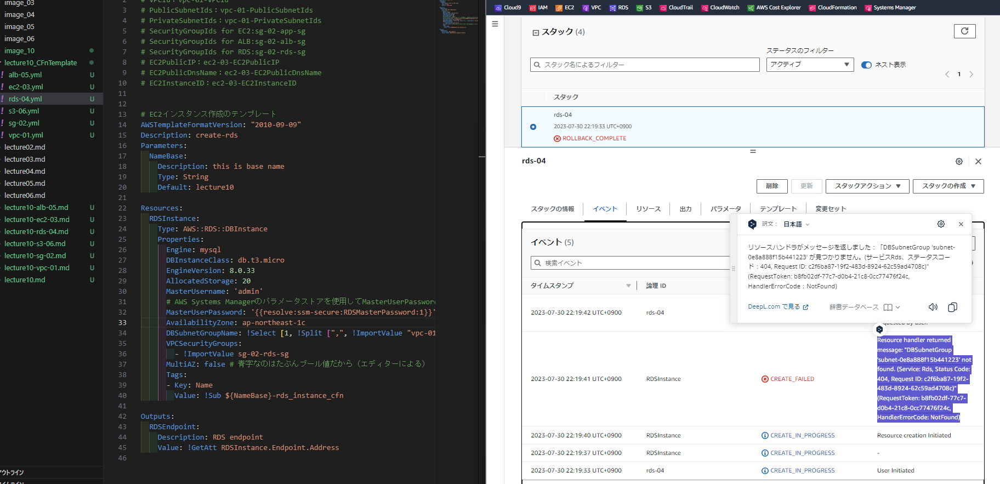

## 準備
* DBエンジンへ接続するためのパスワードをテンプレートに埋め込むこと（それを公開するなら）はなるべく避けるべきと特に第7回講義で習いました。
* 別途設定し、引数的な記述でできないか？と思いました。調べた結果、パラメータストアを使う方法が簡単そうだったので、試しました。（これはCFnを使っていないところが微妙に反則な気がしましたが。。）  
  
  

参考記事）
* [AWS公式）動的な参照を使用してテンプレート値を指定する](https://docs.aws.amazon.com/ja_jp/AWSCloudFormation/latest/UserGuide/dynamic-references.html)
* [CloudFormationで認証情報を扱うベストプラクティス](https://techblog.nhn-techorus.com/archives/17674)

## Resources:
▼論理ID：RDSInstance、DbSubnetGroup01<br>
コンソール画面で確認
  
セキュリティグループの適用確認
  
▼念のためEC2からRDS(MySQL)への接続確認  

## 完了に至るまでに間違えたこと
### 1｜サブネットグループという考え方を把握していなかった
* はじめ、論理ID:RDSInstance内にDBSSubnetGroupNameを指定したら、サブネットが見つからない旨のエラー発生
  
* 公式ドキュメントに見まして↓、DBSSubnetGroupを指定することでVPC指定するとのこと。確かにこのRDSのVPCを設定しているところないなぁと思っていましたがこういう仕組みだったのですね。  
    
    <br>参考記事）  
* [公式）DB サブネットグループの使用](https://docs.aws.amazon.com/ja_jp/AmazonRDS/latest/UserGuide/USER_VPC.WorkingWithRDSInstanceinaVPC.html#USER_VPC.Subnets)
* [CloudFormation による動的サイトの構築自動化](https://hackmd.io/@XPx55BOdQVm_Flkoze74_A/ByEmGFtXH)
### その他参考記事
実は、EC2からRDSへの接続まででGPGキーが最新でないというエラーを返されていて、少しハマっていたので以下の記事参考にしました。　
* [AWS EC2 AmazonLinux2 MySQLをインストールする](https://qiita.com/miriwo/items/eb09c065ee9bb7e8fe06)
* [EC2-Amazonlinux2にMySQL8.0をインストールする](https://tech.noricgeographic.com/amazonlinux2%E3%81%ABmysql8-0%E3%82%92%E3%82%A4%E3%83%B3%E3%82%B9%E3%83%88%E3%83%BC%E3%83%AB%E3%81%99%E3%82%8B/)
##### 実行したcommandのメモ
コマンド
```
sudo yum update
sudo yum remove mariadb-*
sudo yum install https://dev.mysql.com/get/mysql80-community-release-el7-3.noarch.rpm
sudo yum repolist
sudo yum install --enablerepo=mysql80-community mysql-community-server
```
メッセージ
```message
Retrieving key from file:///etc/pki/rpm-gpg/RPM-GPG-KEY-mysql

The GPG keys listed for the "MySQL 8.0 Community Server" repository are already installed but they are not correct for this package.
Check that the correct key URLs are configured for this repository.

 Failing package is: mysql-community-server-8.0.34-1.el7.x86_64
 GPG Keys are configured as: file:///etc/pki/rpm-gpg/RPM-GPG-KEY-mysql
```
コマンド（GPGキーを更新）
```
sudo rpm --import https://repo.mysql.com/RPM-GPG-KEY-mysql-2022
sudo yum install mysql-community-server -y
mysql --version
```
* 実際はいろいろ入れたり消したりしてしまっていたので、以下のコマンドから一回すっきりさせていました。
```
rpm -qa | grep -i mysql
sudo yum remove mysql80-community-release-el7-3.noarch
```