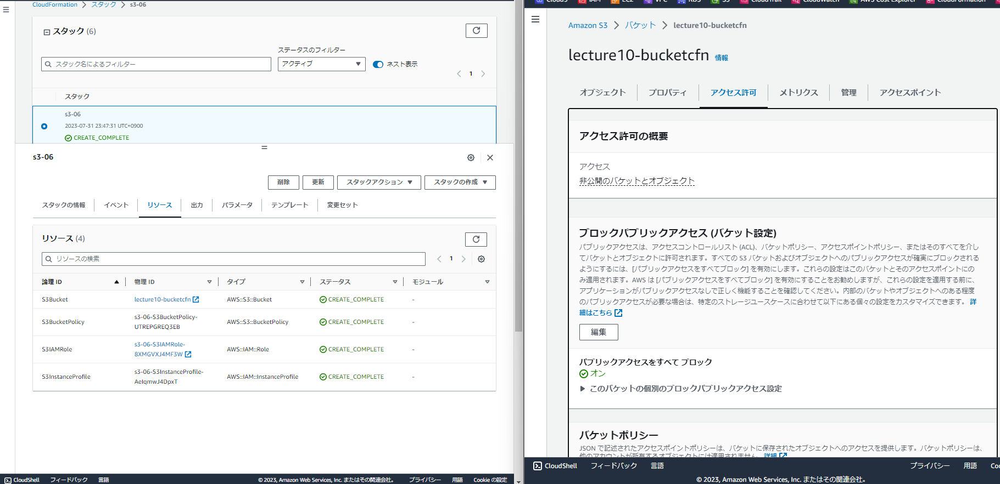
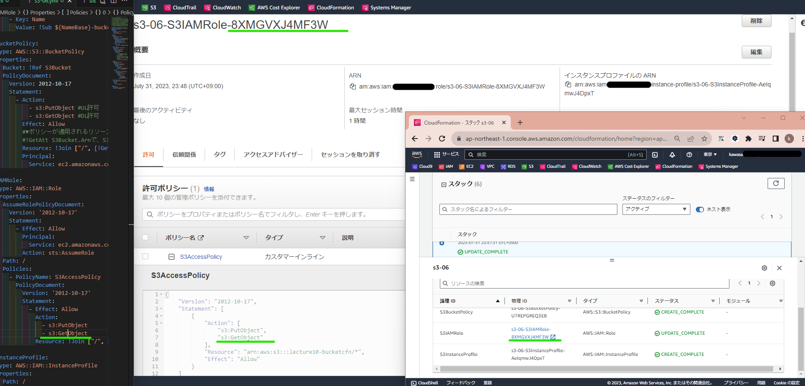
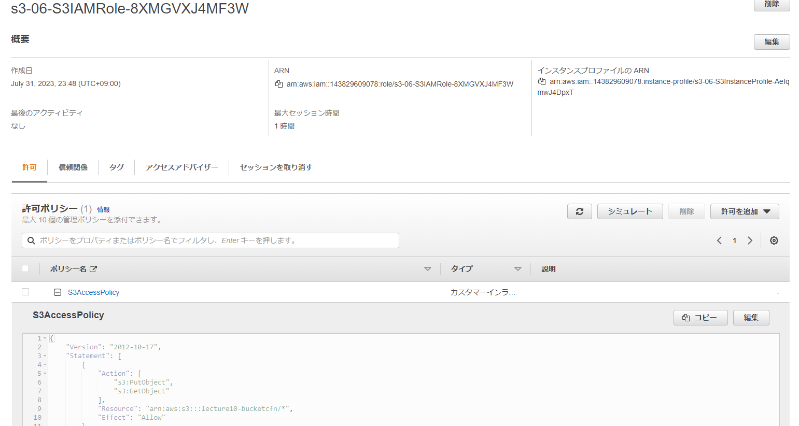
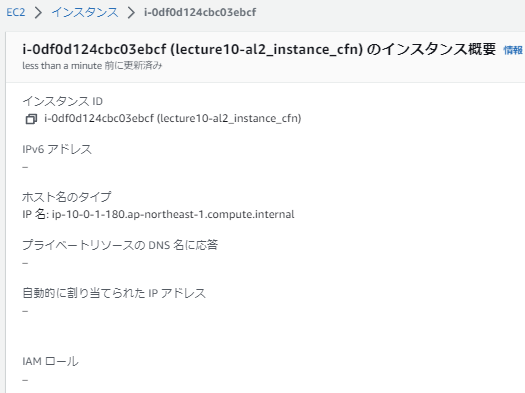
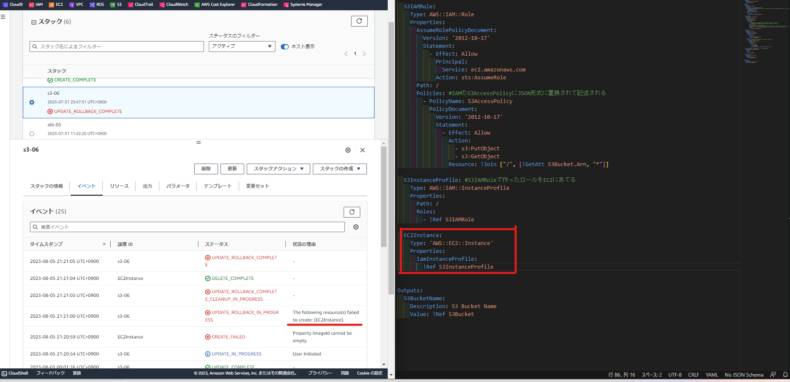

## Resources:
▼論理ID：S3Bucket 
 
▼論理ID：S3BucketPolicy 
  
▼論理ID：S3IAMRole、S3InstanceProfile 
  

## 完全ではないところ
以下の点は今後作成するときの注意・備忘録としてメモしておきます。
### 1｜IAMロールのEC2適用されず
* １）論理ID：S3IAMRole、S3InstanceProfileで同じregion内のEC2にIAMロールが適用されるのかと思っていましたが違いました（下図の通り、IAMロール欄が「-」）。。  
参考記事）[CloudFormationでEC2にIAMロールを付与する](https://qiita.com/predora005/items/480dc3db258e84fcee81)
 
* ２）調べて以下の通りS3作成テンプレート内でIamInstanceProgileでIAMロールを関連付けること記述しましたが（赤枠）、それもエラー起きて無理でした（ちなみに「スタック更新」）。「Failed to create[EC2Instance]」と言っているので、AWS::EC2::InstanceはEC2を作るよという宣言みたいですね。作るにはPropatiesが足りていないのだと思いますし、仮に作れても新たに作られては意味がないですね。  

* ３）どうやら、EC2インスタンスのスタック作成時にテンプレート内で２）を入れておかないといけないようです。  
参考記事）(https://zenn.dev/yuta28/articles/ec2-iam-instance-profile) 

⇒IAMロールは先に作っておくか、アタッチするリソース作成時に同時にテンプレート内に記述を埋め込む方がいいと思いました。