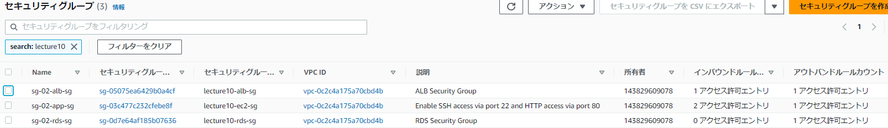

# sg-02.ymlの設定によるもの
* ある程度論理IDのまとまりでキャプチャ貼っています。
* 相互の繋がりはID等を見て確認しています。

## Resources:
いろいろエラーはありましたが最終的に以下の通り作成できました。 
 
▼論理ID：SecurityGroupEC2: 
 
▼論理ID：SecurityGroupALB:: 
 
▼論理ID：SecurityGroupRDS: 
 

## 完了に至るまでに間違えたこと
### 1｜要素の文字列を誤る
▼「VPCIdはサポートされていない」旨のエラーがでました。  
  
以下の公式ドキュメントに立ち返りますと、赤線のところが間違えていました。公式の指定する通りに直し、UPDATE_COMPLETEしました。  
参考記事）[（公式）AWS::EC2::セキュリティグループ](https://docs.aws.amazon.com/ja_jp/AWSCloudFormation/latest/UserGuide/aws-properties-ec2-security-group.html)  

### 2｜SourceSecurityGroupId又はName記述漏れ
▼Stack作成は完了したもののインバウンドルールがない状態になっていました。  
 
▼その時のyamlファイルの状況です
 
調べた結果、RDS(MySQL)用のセキュリティグループのインバウンドルールとしてsourceを記述できていないことが問題だとわかりました。  
参考記事）  [（公式）RDS｜セキュリティグループによるアクセス制御](https://docs.aws.amazon.com/ja_jp/AmazonRDS/latest/UserGuide/Overview.RDSSecurityGroups.html) [（公式）AWS::EC2::SecurityGroupIngress](https://docs.aws.amazon.com/ja_jp/AWSCloudFormation/latest/UserGuide/aws-properties-ec2-security-group-ingress.html) [【AWS】 CloudFormationで基本的な構成のEC2とRDSを作る](https://qiita.com/kobayashi_0226/items/d0f49dbe84937de73a4d)
▼AWS公式の抜粋  
  
▼以下のとおり追記し、上述のとおりインバウンドルールが適用できました。
 