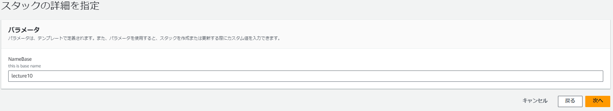
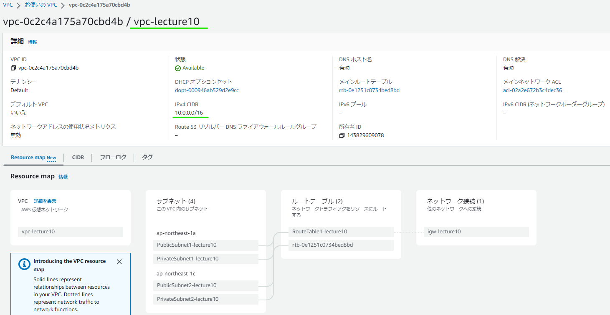

# vpc-01.ymlの設定によるもの
* ある程度論理IDのまとまりでキャプチャ貼っています。
* 相互の繋がりはID等を見て確認しています。
* （感想）結果を見て思いましたが、目で確認する場合は特に、Tagは付けられるものは付けておくに越したことないなとおもいました。
## Parameters:
論理ID：NameBase:
  
## Resources:
▼論理ID：myVPC:

▼論理ID：PublicSubnet1:  
  
▼論理ID：PublicSubnet2:  
  
▼論理ID：PrivateSubnet1:  
  
▼論理ID：PrivateSubnet2:  
  
▼論理ID：InternetGateway:，VPCGatewayAttachment: 
  
▼論理ID：PublicRouteTable:，PublicRoute:，PublicSubnet1RouteTableAssociation:，PublicSubnet2RouteTableAssociation:，  
  

## 完了に至るまでに間違えたこと
### 間違えたこと1
* はじめ、なんでもかんでもTag付ければいいと思って、以下のTypeに対してもTag付けていました（Tags～のところ）。この状態でスタック作成開始するとエラーとなりました。「このTypeにあるTagってところがおかしいよ」という旨でした。
* 確かに、このTypeはリソースとリソースを紐づけるための接着剤みたいな定義なので、userがコンソール画面で見れるわけでもないから必要性がないということなのでしょう。
```
  VPCGatewayAttachment:
    Type: AWS::EC2::VPCGatewayAttachment
    Properties:
      VpcId: !Ref myVPC
      InternetGatewayId: !Ref InternetGateway
      Tags:
        - Key: Name
        Value: !Sub VPCGatewayAttachment-{NameBase}
```
### 間違えたこと2
最初にテンプレートを送信した時（CREATE時）は、組み込み関数のコードが間違えていて"{NameBase}"のままになっていましたので、ymlファイルを修正（$マークつける）し、以下の記事参考にして修正しました。  
参考記事） [【やってみた】AWS CloudFormation実行～テンプレートの更新](https://blog.serverworks.co.jp/2022/02/09/073000)
▼修正前  
  
▼修正後  
表示は「CREATE_COMPLETE」から「UPDATE_COMPLETE」になります
  
NameBaseのParametersで「lecture10」としていたので反映されました。  

 

