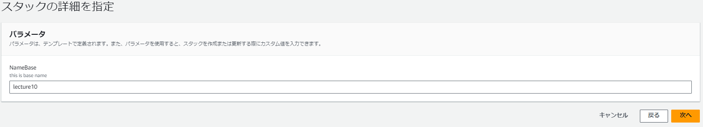
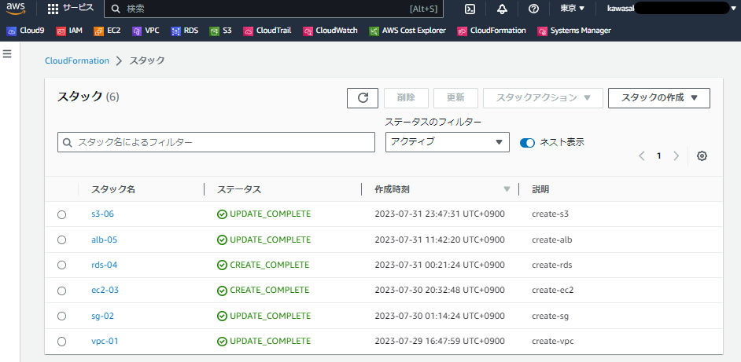

# 第10回課題

## 構成
* 構成は大きくは、[第5回](./lecture05.md)の構成図の通りとなるように進めます。
* 確認しやすさのために「lecture10」というキーワードをTagとしてなるべく埋め込みました。
  * 作成するリソースにはしばしばTagが付けられかつコンソール画面で表示されるようなので。
* 下表の各スタック単位でYAMLファイルおきました。
  * [lecture10_CFnTemplate](./lecture10_CFnTemplate/)
* 下表の各スタック単位でレポートを分けました。表内のリンクを参照ください。

|スタック|リソースなど|備考／クロススタック参照のキー|リンク|
|:---|:---|:---|:---|
|vpc-01|VPC IGW PublicSubnet PrivateSubnet RouteTable |VPCのID SubnetのID|[vpc-01.md](./lecture10-vpc-01.md)|
|sg-02|以下リソース用のSG（3つ） ・EC2（APサーバ） ・ALB ・RDS（MySQL）|sgのID(用途ごとに)|[sg-02.md](./lecture10-sg-02.md)|
|ec2-03|キーペア EC2|EC2インスタンスのID|[ec2-03.md](./lecture10-ec2-03.md)|
|rds-04|RDS|MySQL|[rds-04.md](./lecture10-rds-04.md)|
|alb-05|TagetGroup ALB|ec2と紐づけ|[alb-05.md](./lecture10-alb-05.md)|
|s3-06|S3 IAM|UL・DL可にする|[s3-06.md](./lecture10-s3-06.md)|

### Parameters:
CFnテンプレートで作成したリソースかがかわかりよいようにParametersブロックで「lecture10」を定義しました。そしてできるだけリソースのTagsにくっつけました。
 論理ID：NameBase:

### 作成したスタック一覧（CFnコンソール画面）

# その他
### 組み込み関数のリファレンス
参考記事）[AWS公式ドキュメント](https://docs.aws.amazon.com/ja_jp/AWSCloudFormation/latest/UserGuide/intrinsic-function-reference.html)
### VScodeの拡張機能
* CloudFormation：スニペットを使いたいと思いいれました。
* indenrainbow：YAML形式で書きたいなぁと思い、それならインデント大事だと思い入れました。
* YAML：構文checkとして
* 参考記事）[VSCodeでAWS CloudFormationをYAMLで作成する環境の設定手順](https://nopipi.hatenablog.com/entry/2019/04/27/155616)
### パラメータストア
CloudFormationでキーペア生成を行うと、プライベートキーがAWS Systems Manager パラメータストアに格納されるということでした。  

参考記事）
* [AWSのパラメータストアを使ってみた](https://zenn.dev/rescuenow/articles/7cadc65dfdb698)
* (公式)[AWS CloudFormation を使用してキーペアを作成する](https://docs.aws.amazon.com/ja_jp/AWSEC2/latest/UserGuide/create-key-pairs.html)
  

# 用語
これまでの学習と課題進める中で触れてきたものもありますが、改めて整理しました。
|用語|自分が理解した意味|参考URL|
|:---|:---|:---|
|スニペット|エンジニア界隈では"コードスニペット" テンプレみたいな意味 切り貼りして使いまわせるもの|https://e-words.jp/w/%E3%82%B9%E3%83%8B%E3%83%9A%E3%83%83%E3%83%88.html|
|CIDR|アドレスクラスの概念がない 末尾の数字がネットワーク部分を２進数で範囲指定 └/24：左から24桁目までがサブネット化されている（10進数で255.255.255.0表記） └/20：左から20桁目までがサブネット化されている（10進数で255.255.240.0表記）|https://wa3.i-3-i.info/word11989.html https://envader.plus/article/52 |