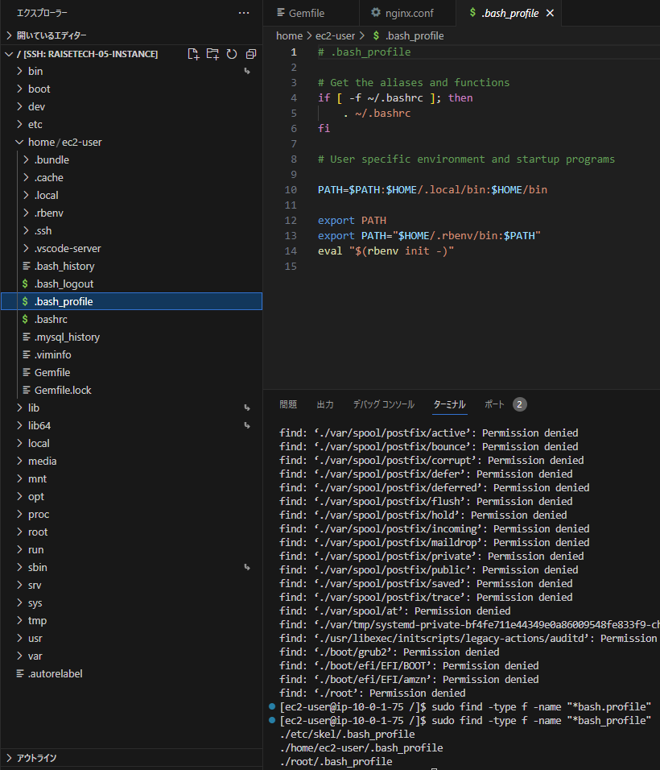

# 第11回課題
### 課題内容
**SeverSpecのテストが成功すること**
* サンプルコードを使ってSeverspecのテストを稼働させる
* サンプルコード）https://github.com/MasatoshiMizumoto/raisetech_documents/tree/main/aws/samples/serverspec
* 公式doc）https://serverspec.org/

### 基本理解
* テスト駆動開発(TestDrivenDevelopment:TDD)：テストありきで開発する方法。設計に基づいてまずはテストを先に作り、このテストが成功するように開発する手法
* インフラの自動テストのツールとして、ServerSpec、awspec、Terratest、Infratasterなどがある（参考記事：https://www.sbbit.jp/article/cont1/51207）
* ServerSpec：Rubyで作成されたインフラ環境をテストするための**フレームワーク**

### 実施
今回はテストする側(ServerSpec)とされる側(Nginxなど)が同じサーバー内にいる場合状態で稼働させました。
#### 1.Rubyの環境構築
復習も含め空のEC2(Amazon Linux2)にてrubyの環境を作りました。この際なので、コマンド順に説明も備忘録的に付記しました。
▼インストール済みパッケージを最新の状態にアップデート
```bash
sudo yum update -y
```
▼yumでgitやgccなど一気に入れていきます。半角スペースが各モジュールの区切り
```bash
sudo yum -y install git gcc-c++ glibc-headers openssl-devel readline libyaml-devel readline-devel zlib zlib-devel libffi-devel libxml2 libxslt libxml2-devel libxslt-devel sqlite-devel
```
* gitはあとでrbenvをgitcloneで入れたいので
* gcc、openssl-devel、zlib-develはRubyのコンパイルにいるそうです
* openssl-develもRubyのコンパイルにいるそうです
* 参考記事）
 * [EC2にrubyをインストールする手順 rbenvからbundlerの解説](https://hitolog.blog/2021/10/13/how-to-ruby-install/)
 * [CentOS系 + openssl-devel 導入でてこずった件](https://qiita.com/edward999th/items/a9f52b440f8f0e783782)
 * [readlineとは何か、どんな問題があるか](https://qiita.com/tomtsutom0122/items/60f0ab22771a8c65247a)
 * とりあえずRubyの環境構築に必要そうということで理解したのでまとめてChatGPTに聞いてみました<br>
 ▼ruby環境構築に必要なパッケージのChatGPTからの説明<br>
   

▼rbenvをダウンロード
```bash
git clone https://github.com/sstephenson/rbenv.git ~/.rbenv
```
▼rbenvをつかえるようにするための指示。よく「環境変数のPATHを通す」というあれ。
```bash  
echo 'export PATH="$HOME/.rbenv/bin:$PATH"' >> ~/.bash_profile  
echo 'eval "$(rbenv init -)"' >> ~/.bash_profile  
source ~/.bash_profile  
```
* 1行目：~/.bash_profile ファイルに、rbenvの実行ファイルがあるディレクトリを環境変数 PATH に追加するよう指示します。これにより、rbenvコマンドをターミナルで直接実行できるようになります。
* 2行目：~/.bash_profile ファイルに、rbenvの初期化スクリプトを実行するよう指示します。これは、rbenvがシェルに統合され、Rubyのバージョンを切り替えたり管理したりできるようにします。
* 3行目：~/.bash_profile ファイルを再読み込みして、変更を即座に適用します。これにより、前述の環境変数やrbenvの初期化が現在のシェルセッションに反映されます。
* ただPATH通すって事象がどういったことなのか、実態を見たくて以下の通り確認しました。
* ▼`sudo find -type f -name "*bash_profile"`でbash_profile自体を探す
* ▼hom>ec2-userの直下にありまして、中身見ると、echoで指示した内容が書き込まれているようでした。調べると`echo 追記する文字列 >> ファイル名`でファイルに文字列を追記できるようです（参考記事：[echoコマンドでファイルに追記する(中段)](https://eng-entrance.com/linux-command-echo)）<br>
 
* ▼ちなみにほかのディレクトリのbash_profileは書き込まれていないのです<br>
 
* ▼rootディレクトリ下のbash_profileはIDEで表示できなかったのでcatで確認<br>
 

▼rbenvのプラグインであるruby-buildをダウンロード
```bash 
git clone https://github.com/rbenv/ruby-build.git ~/.rbenv/plugins/ruby-build  
cd ~/.rbenv/plugins/ruby-build
sudo ./install.sh
```
* ruby-build：rbenvを使用して簡単にRubyのバージョンをインストールできるようにするためのツール
* sudo ./install.sh：ruby-build のインストールスクリプトを実行して、rbenv install コマンドを使用してRubyのバージョンをインストールするための準備をする。中身は以下の様態<br>
 <br>

▼後でRailsアプリ入れるかもしれないので、アプリ側のREADEMEに沿って3.1.2指定
```bash
rbenv install 3.1.2 -v  
```
▼どこのディレクトリでも使えるようにglobal指定してrubyのインストール確認
```bash
rbenv global 3.1.2
ruby -v
>>>ruby 3.1.2p20 (2022-04-12 revision 4491bb740a) [x86_64-linux]
```

#### 2.SeverSpecインストール
一旦`cd ~`(cdだけでok)でホームに戻ってから以下実行しました<br>

```bash
gem -v
>>>3.3.7
gem install bundle          #bundlerインストール
bundle -v                   
>>>Bundler version 2.3.7
bundle init                 
gem install rake            #rakeをインストール
rake --version
>>>rake, version 13.1.0
gem install serverspec      #ServerSpecをインストール
```
* `bundle init`はGemfile生成するためにやりましたが、後でgemから直接severspecインストールしたので、なくてもよかったかもです。
* gemからインストールしない場合はGemfile（この場合ec2-user直下）に`gem "serverspec"`を追記して(rakeも同様)`bundle install`することになります


#### 3.ServerSpecの初期セットアップ
* `serverspec-init`で準備完了→`rake spec`でテスト稼働になるのですが...
* はじめ、ホームディレクトリで上記実行しせいで？、うまくいかなかったので、別のディレクトリで初期設定することにしました
* あとでいろいろ調べてみるとserverspecの作業用ディレクトリを作ってから`serverspec-init`をしているひとの方がおおい印象です
```bash
#作業用ディレクトリ作る前の前後確認
ls -al /etc/ | grep server
#ないので作る
sudo mkdir /etc/serverspec
#作られたこと確認
ls -al /etc/ | grep serverspec
#所有者変更
sudo chown -R ec2-user /etc/serverspec
ls -al /etc/ | grep serverspec
#後述の通りの構成でファイルが生成されるのでそのbrforeとしての確認
cd /etc/serverspec
ls -al
ls -al ./spec

serverspec-init
```
初期設定のコマンド直後、各種パラメータ設定を求められるので以下の通り回答
```bash
Select OS type:

  1) UN*X
  2) Windows       

Select number: 1                       # UN*Xなので1選択

Select a backend type:

  1) SSH
  2) Exec (local)

Select number: 2                       #同じEC2内なので2選択

Vagrant instance y/n: n                #vagrantではないのでn選択

Input target host name: test-server    #テストするサーバのホスト名を入力
```
**Vagrant**(ベイグラント)
* VMwareやVirtualBoxの「コマンドラインのフロントエンド」として動作するソフト
* Dockerはコンテナ型の仮想化、Vagrant(正確にはVirtualbox)はホスト型の仮想化


上記まで完了すると以下の構成でファイルが生成されます
```bash:serverspec/
├── Rakefile
└── spec
    ├── localhost
    │   ├── sample_spec.rb
    │   └── sample_spec.rb.bk
    └── spec_helper.rb
```
* やってないけど参考記事）[Serverspecでテスト自動化-IDCFテックブログ]https://blog.idcf.jp/entry/serverspec-auto-test

#### 4.テストコードを変更
* 「sample_spec.rb」を以下の通り変更
* before(default)<br>

* after
```ruby:sample_spec.rb
require 'spec_helper'

listen_port = 80    #Nginxがデフォルトで80ポートで待ち受けなので修正しました

describe package('nginx') do
  it { should be_installed }
end

describe port(listen_port) do
  it { should be_listening }
end

describe command('curl http://127.0.0.1:#{listen_port}/_plugin/head/ -o /dev/null -w "%{http_code}\n" -s') do
  its(:stdout) { should match /^200$/ }
end
```
#### 5.Nginxインストール
```bash
amazon-linux-extras list | grep nginx   #Amazon Linux2にはnginxのyumが無いので、Amazon Linux Extrasでnginxを探す
sudo amazon-linux-extras install nginx1
nginx -v
>>>nginx version: nginx/1.22.1
sudo systemctl start nginx
sudo systemctl status nginx #sudoなしでいい
sudo systemctl enable nginx
systemctl is-enabled nginx
```

#### 6.テスト実行（成功）
ディレクトリ`/etc/serverspec`に移動し`rake spec`でテスト稼働<br>
▼結果：成功しました<br>


====
====
#### テスト実行して失敗したこと
* はじめは、3つ目のテスト項目が502Bad Gatewayが返ってきました。
* 3つ目：curlコマンドでhttpリクエストを飛ばし、返ってくるステータスコードが200(ok)であるか(問題ないなら「200」が返され、ハードコードの200と一致するからクリアとなる)
* curl：コマンドラインからHTTPリクエストを送信するためのオープンソースのライブラリやツールのこと<br>
<br>

いろいろ調べて試行錯誤しまして、nginx.confのlocationブロックが影響しているとわかりました。<br>
▼nginxconf修正locationブロックをコメントアウト<br>
<br>

* ちなみに、失敗した方の環境は、テスト実行（成功）のEC2とは別のEC2での環境でやりました。
* Nginxのデフォルトでlocationブロックが入っているとき、かつ、Nginx単体で稼働させる場合はこのエラーがでるようです
 
#### 考察
**事実確認**
* [x] 80ポートでの待ち受け自体は可能
* [x] Apachのように、インストールしただけでは200番を返さないミドルウェアもある
* [x] 単純にポートが解放されているだけでは、ページを正常に表示できるとはいえない
* [x] 第5回ではうしろにあるUnicornのソケットにリクエストをながしていた
* [x] `curl http://127.0.0.1`の127系のアドレスはローカルループバックアドレスといって、自分自身を表す特別なIPアドレス（実質的には「127.0.0.1」から「127.255.255.254」の範囲）
* [x] locationブロックは、相手のリクエストしてきたURI(URL)に対して、locationで設定した内容に応じたページを表示するように出し分けている
* [x] 今回はNginxのうしろにアプリケーションサーバーも、色んな種類のリクエスト(URLによる違いなど)がわるわけでもないのに、locationディレクティブでリバースプロキシの設定をいれていた。
* [x] 検証したところ、locationブロックがブロックごと無いか、{}の中身が有効になっていないか、の場合serverブロック側でindex.htmlに導かれるようになっていた→`root /usr/share/nginx/html`

**考察**
* [ ] 行先がないのに、locationブロックに記述をいれていたことで、行方不明なところにリクエストを流したことでサーバー異常とみなされたのでは？

参考記事）
* https://www.youtube.com/watch?v=7VAI73roXaY 17分以降から
* ループバックアップアドレス：https://wa3.i-3-i.info/word17065.html
* Nginxによるリバースプロキシの設定方法：https://qiita.com/schwarz471/items/9b44adfbec006eab60b0
* Nginxの名前の由来と設定ファイルの書き方、locationの書き方：https://qiita.com/yassun-youtube/items/520956830b2512e2eb5b

