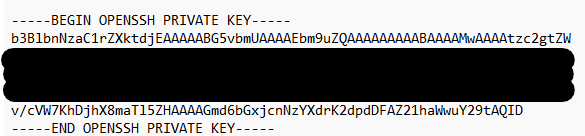
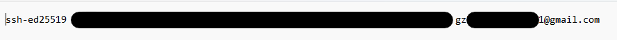
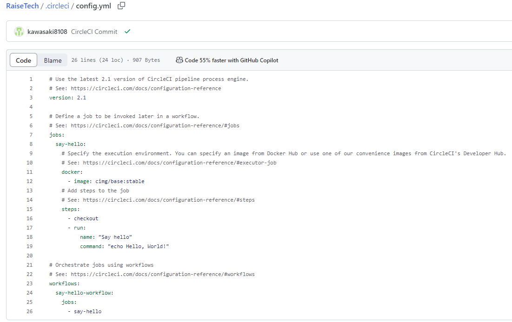
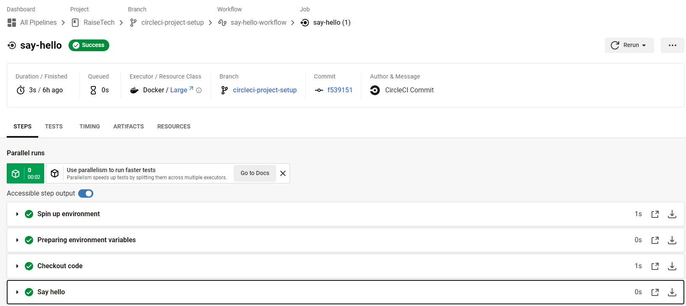
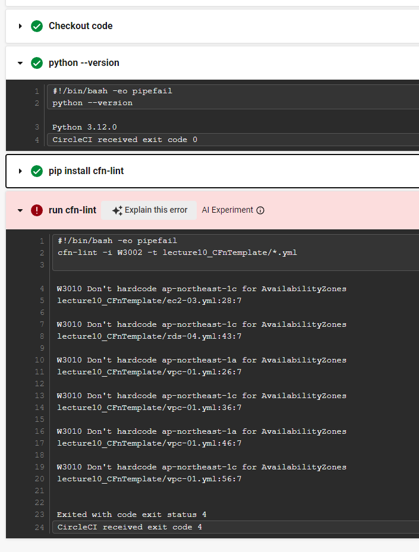
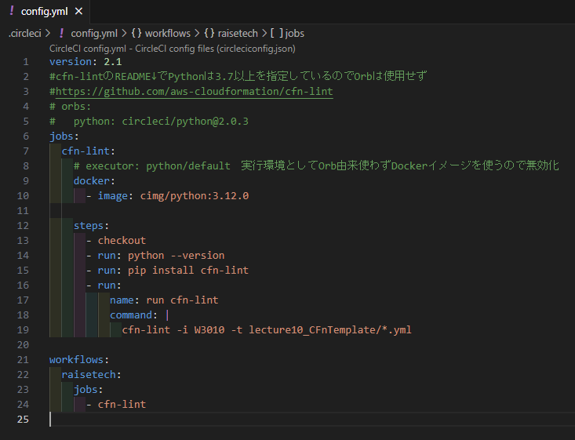
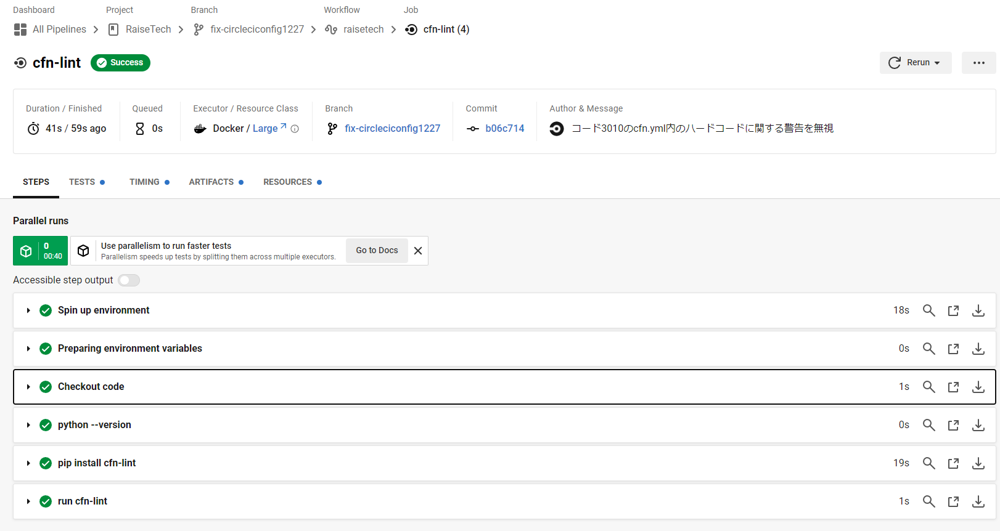

# 第12回課題
### 課題内容  
- CircleCIのサンプルコンフィグを正しく動作させるようにリポジトリに組み込む。
- [サンプルコンフィグ](https://github.com/MasatoshiMizumoto/raisetech_documents/tree/main/aws/samples/circleci)：cloudformationディレクトリ内のymlファイルをチェックするもの
### CircleCIの動作確認
1. CircleCIの[スタートガイド](https://circleci.com/docs/ja/getting-started/)に沿って設定
   * はじめてつかうのでサインアップ
   * 左のペインのプロジェクトにて、GitHubのrepoと連携
   * 公開鍵、秘密鍵がローカル(C>user>.ssh内)に自動格納される
   * ▼project_key：秘密鍵
   * 
   * ▼project_key.pub：公開鍵
   * 
   * 公開鍵を連携したいGitHubのrepo>Setting>Deploy key(左のペイン)から埋め込む
   * 秘密鍵をCircleCIの画面誘導に沿って埋め込む
   * 参考記事）https://qiita.com/Nagisa-kjm/items/078e04915b8f5ed2879f
2. GitHubの指定したリポジトリに.circleciフォルダが生成される
▼CircleCI_01_初期動作確認<br>

3. CircleCIのダッシュボード上で初期設定のワークフロー「say-hello」が実行され、正常に動作したことがわかる
▼CircleCI_01_初期動作確認<br>


### サンプルコンフィグ適用
#### 先にコードのカスタム
* リンターcfn-lintはPythonのライブラリとして稼働させるものであることがREAMDEでわかりました
* [README](https://github.com/aws-cloudformation/cfn-lint)的にはPython3.7以上を要求しているので、以下の部分は使わずとしました
  ```yml
  orbs:
      python: circleci/python@2.0.3
  jobs:
    　cfn-lint:
        executor: python/default
  ```
* Pythonは最新のもので使おうと以下の記事を参考にして、```executor: python/default```の部分以降を修正しました
参考記事）https://circleci.com/developer/ja/images/image/cimg/python
  ```yml
        docker:
            - image: cimg/python:3.12.0
  ```
#### 適用結果
* 上述のとおり記載修正し、GitHubにpushすると以下の警告が返されました。
* ちなみにPythonは意図したverが使えているようでした
 ▼アラート箇所確認<br>
 
* AZをハードコーディングしていることによるものでした
* 大きな問題ではないので、下図の通りコードを修正しました（19行目：3002→3010）
 ▼修正後のymlファイル<br>
 
 ▼修正後の適用結果◎<br>
 


## 学んだ事
- .circleciフォルダ下のconfigファイルを修正してGitHubにpushすると自動的にJob実行される
- PRをmergeしたときもJobが実行される
- 参考記事：CI/CDの契機）https://qiita.com/gold-kou/items/4c7e62434af455e977c2
- いつもorbを使わないといけないことはない
- orbは記述を軽くさせてくれている
- ```executor:```は実行環境は○○という宣言ととらえられる
- インストール確認のコマンドなど、確認用コマンドはダッシュボード上はありすぎると醜くなるが、後で振り返ったときにどこでつまづいているかはわかりやすくなる

