# 第13回課題
## 課題内容  
- CircleCIにServerSpecやAnsibleの処理を追加する
## 実施結果
- 別のリポジトリ[「CircleCI-Ansible-test」](https://github.com/kawasaki8108/CircleCI-Ansible-test/tree/circleci-project-setup)の「circleci-project-setup」ブランチで実施しましたので、ソースコードはそちらでご確認ください。
### 全体的な構成
<details>
<summary>インフラ構成図</summary>

.png)
</details>

<details>
<summary>環境構築自動化のためのディレクトリとファイルの構成</summary>

```
$ tree
.
├── README.md
├── ansible
│   ├── inventory
│   │   └── target.yml
│   ├── roles
│   │   ├── app_clone
│   │   │   └── tasks
│   │   │       └── main.yml
│   │   ├── appserver-env-setup
│   │   │   ├── files
│   │   │   │   └── puma.service
│   │   │   ├── handlers
│   │   │   │   └── main.yml
│   │   │   ├── tasks
│   │   │   │   └── main.yml
│   │   │   └── templates
│   │   │       ├── application.rb.j2
│   │   │       ├── database.yml.j2
│   │   │       ├── development.rb.j2
│   │   │       └── storage.yml.j2
│   │   ├── git
│   │   │   └── tasks
│   │   │       └── main.yml
│   │   ├── mysql
│   │   │   └── tasks
│   │   │       └── main.yml
│   │   ├── ruby-bundler
│   │   │   ├── tasks
│   │   │   │   └── main.yml
│   │   │   └── vars
│   │   │       └── main.yml
│   │   ├── webserver-env-setup
│   │   │   ├── files
│   │   │   │   └── index.html
│   │   │   ├── handlers
│   │   │   │   └── main.yml
│   │   │   ├── tasks
│   │   │   │   └── main.yml
│   │   │   └── templates
│   │   │       ├── index.html.j2
│   │   │       └── nginx.conf.j2
│   │   └── yum-update
│   │       └── tasks
│   │           └── main.yml
│   └── site.yml
├── ansible.cfg
├── cloudformation
│   ├── alb-05.yml
│   ├── ec2-03.yml
│   ├── rds-04.yml
│   ├── s3-06.yml
│   ├── sg-02.yml
│   └── vpc-01.yml
└── serverspec
    ├── Rakefile
    └── spec
        ├── spec_helper.rb
        └── target
            └── target_test_spec.rb
```
</details>

### CircleCI上の環境変数の設定
##### ▼SSH Keysの設定<br>
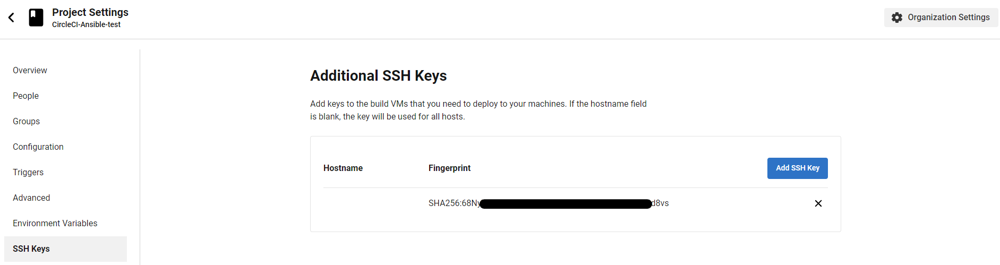
##### ▼環境変数の設定<br>
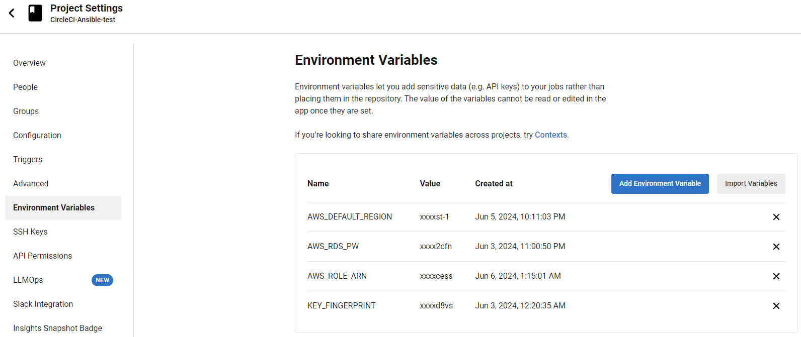
### CircleCIでの実行結果
##### ▼ワークフロー全体
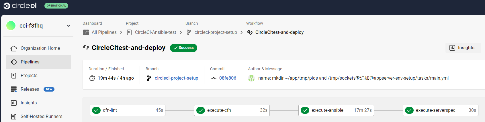
##### ▼CFnテンプレートファイルのリンターテスト
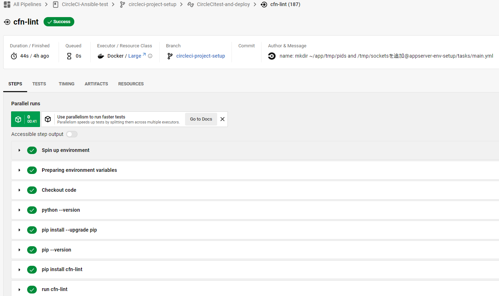
##### ▼CFnデプロイ
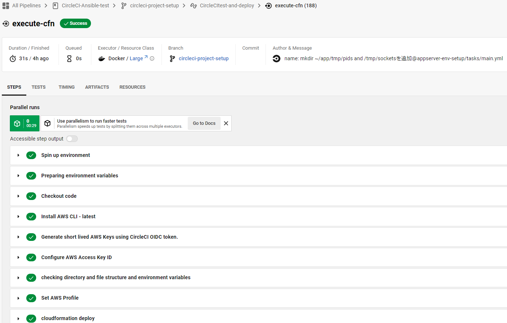<br>
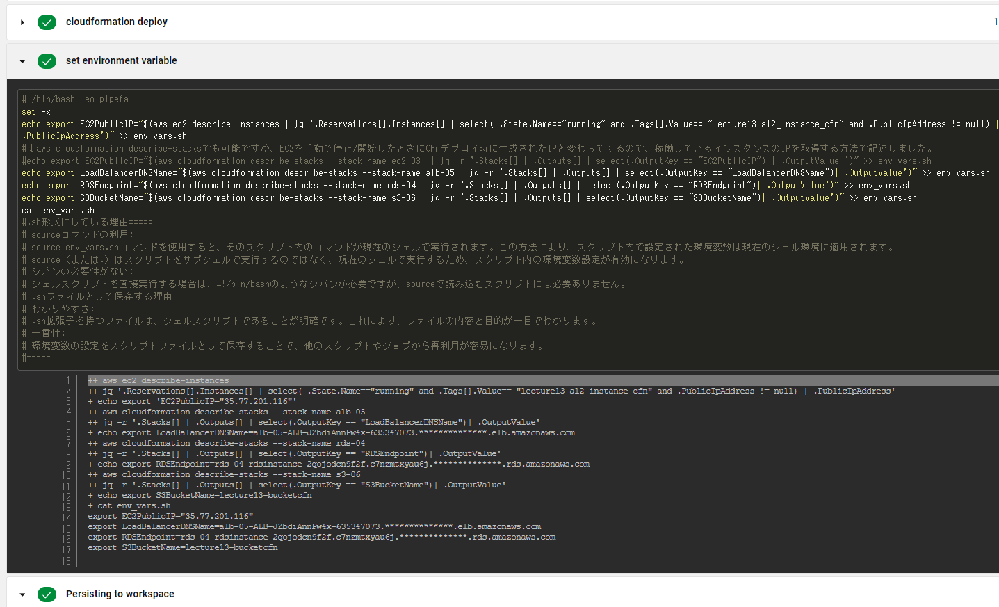
##### ▼ansibleの実行
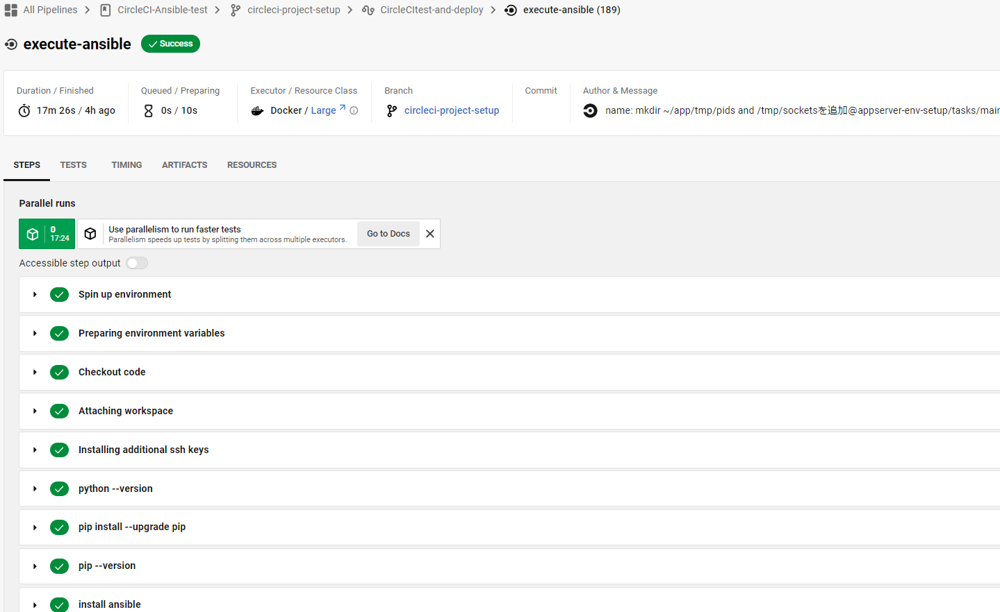<br>
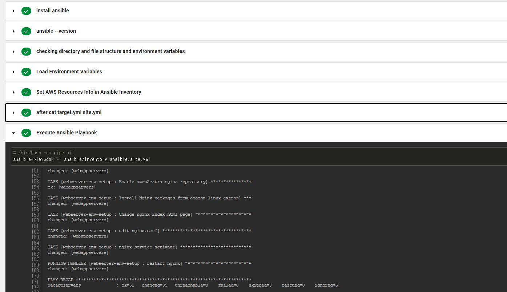
##### ▼SeverSpecの実行
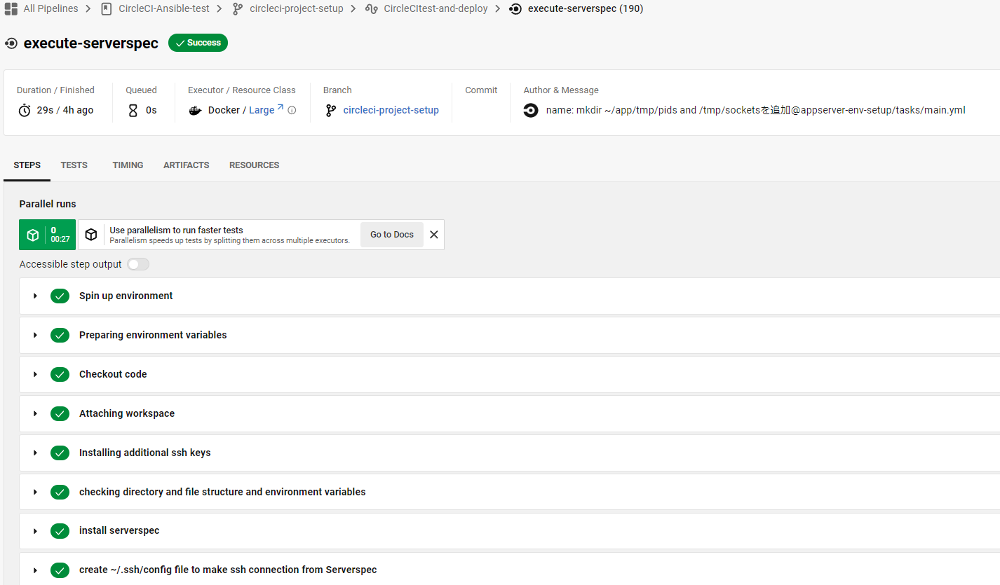<br>
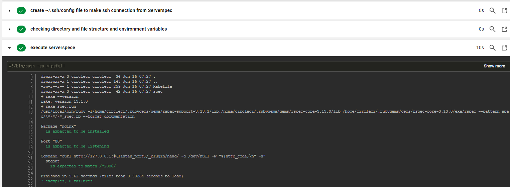
### 動作確認
##### ▼Upload用の画像の事前確認
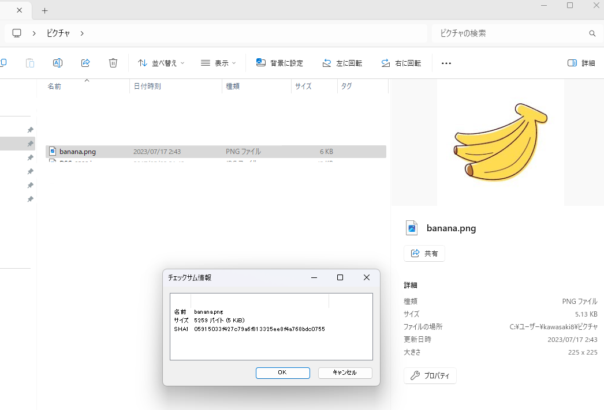
##### ▼Upload用の画像の事前確認
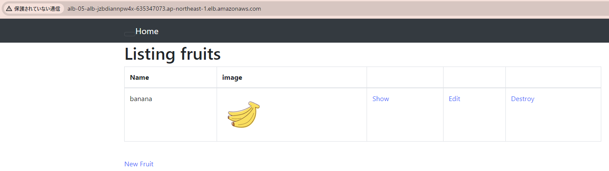
##### ▼Upload後の画像の確認(事前との一致確認)
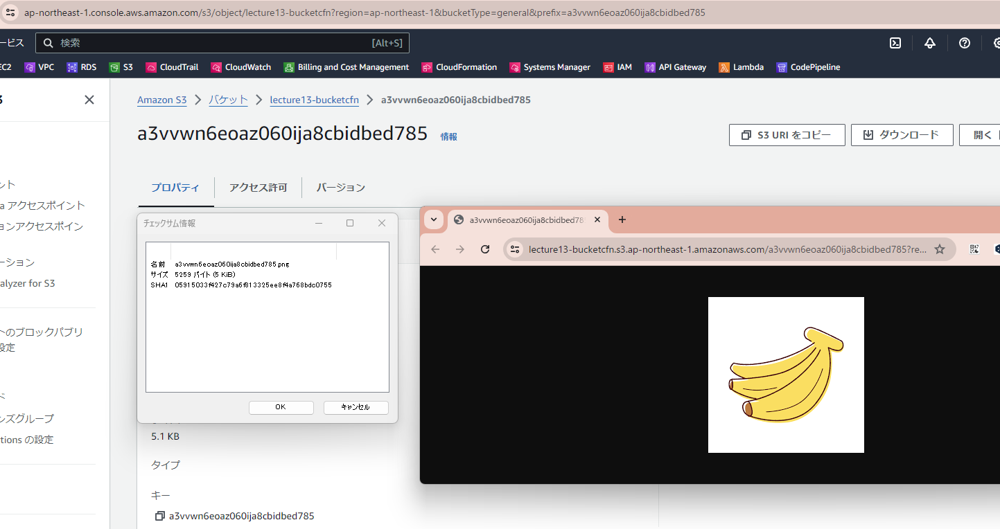


## 実施手順
### 前提
- （個人的課題）CFnで構築したリソースからインスタンスのIPやエンドポイントなどを動的に取得してansibleに情報を渡し、リソース構築からテストまで途切れず走らせること
- 以下については自動化の範囲外としました。
  - 鍵の設定：アプリケーションの実行サーバーであるEC2との接続は既存のキーペアを使ったSSH接続とする
  - RDS(MySQL)のパスワード設定：事前にAWS Systems ManagerのParameterStoreに格納したものを使う
  - OIDC用のIAMRoleは事前にマネージメントコンソールで作成したものを使う
### 詳細手順
- 簡単書いても月並みの内容になるかなと思いあえて細かく記載しました。
- わかりにくいところは粒度落としているので、粒度にばらつきがあります。
- 自分のメモの要素もあるのでトグルにしました。よければ展開くださいませ。
<details>
<summary>展開</summary>

1. ansibleの実行環境構築のため、ローカル(WinPC)にWSL2(ディストリビューション：Ubuntu-22.04)を導入
2. UbuntuにPythonとpipによりAnsibleを導入（[公式](https://docs.ansible.com/ansible/2.9_ja/installation_guide/intro_installation.html)参照）
3. [ローカルUbuntuのAnsibleからアドホックコマンドで、ターゲットノードのEC2インスタンスへコマンドをなげられるか確認](https://zenn.dev/kawasaki8108/articles/20240225-ansibleadhoc)
4. [ローカルWSL2のAnsible-playbookでEC2にwebサーバーを導入しモジュールの使い方やファイルの変更し方を理解する](https://zenn.dev/kawasaki8108/articles/20240302-plybkwbsrvr)
5. [第5回](https://github.com/kawasaki8108/RaiseTech/blob/main/lecture05.md)で使用した[Railsのサンプルアプリケーション](https://github.com/yuta-ushijima/raisetech-live8-sample-app)の実行環境を構築できるようにansible-playbook用のymlファイルを作成する
    - 第5回で実施したときはアプリケーションサーバーはunicornを使っていましたが、rubyのバージョンアップに伴いpumaに変更されたので、pumaを使用する方針としました。
    - rubyはrbenvを使って導入することにしました。
    - ansible-galaxyを使ってroleの機能を使いました。
6. ローカルのansibleから問題なくアプリケーションの環境構築ができることを確認後、別リポジトリを作成([CircleCI-Ansible-test](https://github.com/kawasaki8108/CircleCI-Ansible-test/tree/circleci-project-setup))し、このリポジトリとCircleCIを連携
7. 「circleci-project-setup」ブランチにansibleフォルダ、ansible.cfgファイルを追加
8. CircleCIのプロジェクト設定のSSH keys機能を使い、事前に保持しているキーペアの中身(秘密鍵の文字列)を`Add SSH Key`で設定(Host nameは空欄でもok)し自動生成されたFingerprint(SHA256ハッシュ値)を環境変数`KEY_FINGERPRINT`の中身として設定
9. CircleCIからansibleを稼働させてコントロールノードにSSH接続＋環境構築できることを確認する
    - CircleCIのansibleのOrbはベースがpython2であるため、Orbを使わずにpython3環境構築できるcimgを使いました。
10. 第10回で使用したCFnテンプレートファイルが格納されたフォルダを前述のブランチに追加
11. CircleCIからCFnを実行するためにOIDCを利用してAWSと認証連携する設定をする
    - AWS側でIAMRoleを作成
      - Cloudformationの実行権限だけではだめで、CFnで作成するリソースを操作する権限が櫃世になる
    - IDプロバイダで自分が使っているCircleCIの情報を登録する
      - プロバイダのURL(OpenID Connect)：`https://oidc.circleci.com/org/組織ID`
      - 対象者：`組織ID`
    - 作成したRoleの信頼エンティティに当該CircleCIの組織IDが認証連携される先として登録する（以下参考）
      - https://zenn.dev/kou_pg_0131/articles/circleci-oidc-aws
      - https://circleci.com/docs/ja/openid-connect-tokens/#limit-role-access-based-on-project
    - CircleCIの環境変数`AWS_ROLE_ARN`をつくり中身に上述で作成したRoleのarnを格納する
12. CircleCIからAWSCLIコマンドによりCFnデプロイするjobを加え、問題なく実行できることを核にする
13. CFnデプロイしたリソースに対してAWS CLIで以下の情報を取得し.shに書き出し、persist_to_workspace機能でjob間で受け渡しできるようにする記述を入れる
    - EC2のグローバルIPv4
    - RDSのエンドポイント
    - ALBのDNS名(Aレコード)
14. CFnデプロイのjob→ansibleのjobがノンストップで流れるか確認する
    - ansibleのjob内でコマンド`source ●●.sh`によりシェル環境変数として設定する
15. 当該ブランチにServerSpecのフォルダ(`severspec-init`を実行した後のフォルダ構成)を追加し、CircleCIのconfig.ymlにServerSpecがEC2に対してSSH接続できる設定を作成する(追記する)
    - 上述の.shをansibleの時と同じく読み込む
    - ~/.ssh/configファイルを作成してHost name、Userの情報を書き出す
16. sercerspecフォルダ内の各種ファイルを編集する
    - `spec_helper.rb`にSSH接続する設定を入れる
    - `Rakefile`にrake specコマンド実行時に読み込むファイル(各種テストを記述したファイル)など基本設定をいれる
    - `●●_spec.rb`にテストの記述を入れる←ファイル名やディレクトリ構成は`Rakefile`内で指定したディレクトリ・ファイル名と揃える
17. CircleCIのconfig.ymlにServerSpecの実行コマンドや環境変数の設定(environmentsの記述)を入れてCircleCIを走らせ問題なくSeverSpecでのテストが実行されることを確認する
18. 以上が問題なく実行完了したら完成

</details>


## 特に理解が深まったこと
特に難渋したところでもあります。以下の点です。
- ansible）yarnのバージョン指定方法：インストールしてからセットする
- ansible）mysqlクライアントの導入：GPGキーが2023版がある
- ansible）pumaをsystemctlで起動する：socketsフォルダとpidフォルダを事前に作成しておく
  <details>
  <summary>展開</summary>

  - ▼pumaが起動できないエラー(ansible上)
  .png)
  - ▼puma.serviceファイル内に記述されたコマンドを叩いた後のエラー(socketsフォルダがない)
  .png)
  - ▼socketsフォルダ追加後再トライしたあとのエラー(pidフォルダがない)
  .png)
  - ▼pidフォルダを追加後再トライして解消した図
  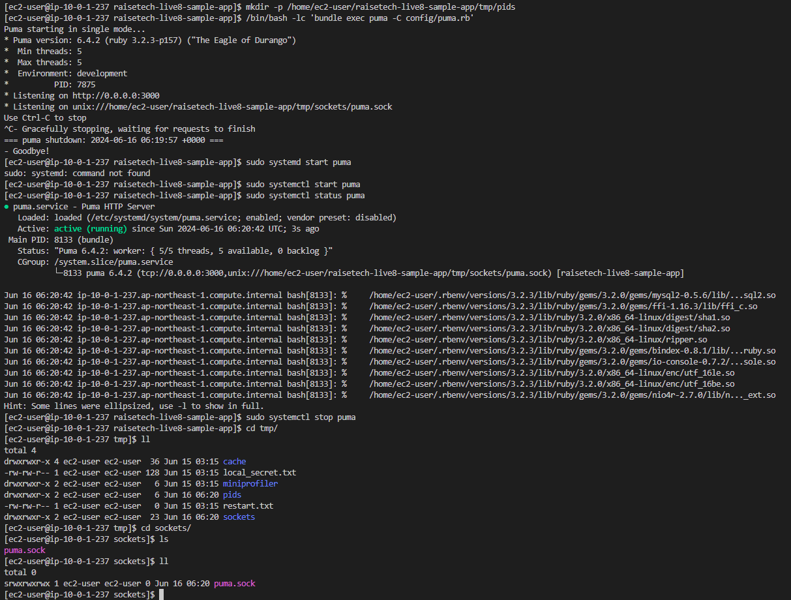
  - ▼解消策をansibleに適用した後のymlファイル
  .png)

</details>

- CircleCI）AWSとの認証連携にOIDCを使う：config.ymlではcircleci/setup機能を使う
  <details>
  <summary>展開</summary>

  - ▼AWS IAMのIDプロバイダの設定
  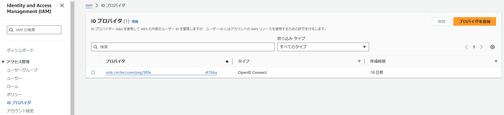
  - ▼IAMRoleの信頼エンティティの設定画面
  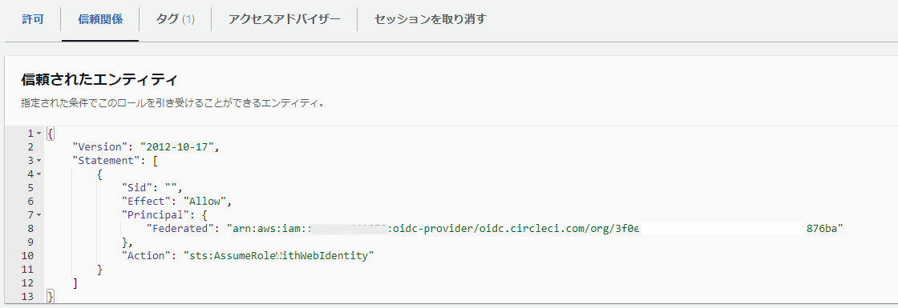
  - ▼信頼エンティティ(ポリシー)
    ```
    {
        "Version": "2012-10-17",
        "Statement": [
            {
                "Sid": "",
                "Effect": "Allow",
                "Principal": {
                    "Federated": "arn:aws:iam::AWSカウントID:oidc-provider/oidc.circleci.com/org/CircleCIの組織ID"
                },
                "Action": "sts:AssumeRoleWithWebIdentity"
            }
        ]
    }
    ```

  </details>

- CircleCI）CFnで構築したリソースのIPアドレス等を動的に取得しjob間で受け渡す：persist_to_workspaceを使う＋.shファイルにexport文をいれておいて各job内で実行して環境変数として認識させる
- CircleCI）マウントしているリソースにSSH用の秘密鍵を持たせる仕組み：CircleCIのadd_ssh_keys機能（今回はansibleとSeverSpecのjobに渡している）
- ServerSpec）EC2へのSSH接続方法：CircleCIのadd_ssh_keys機能をそのままつかえる
- ServerSpec）Rakefile、spec_helper.rbの記述

